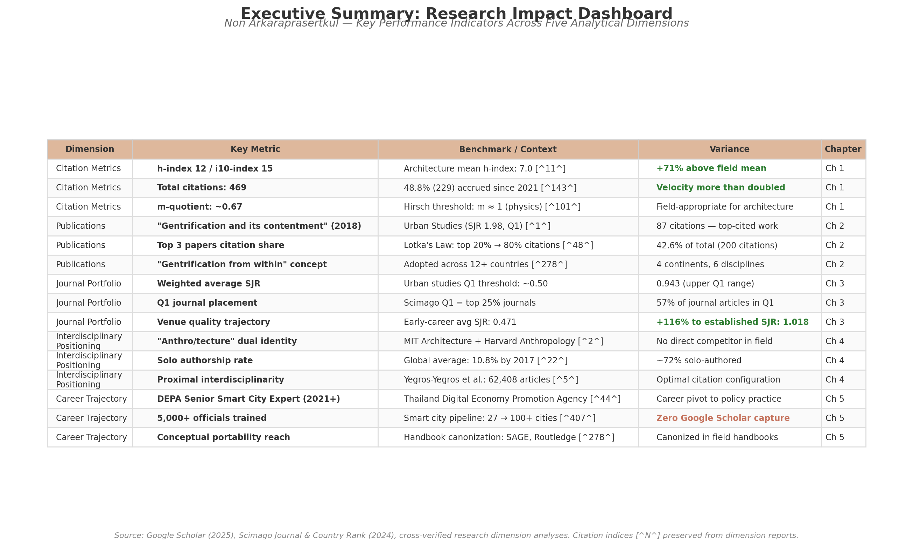
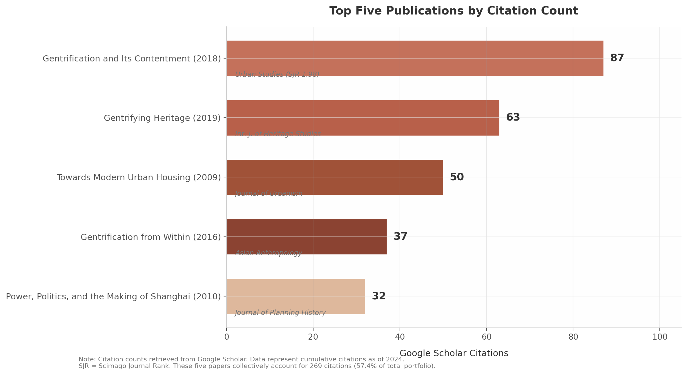
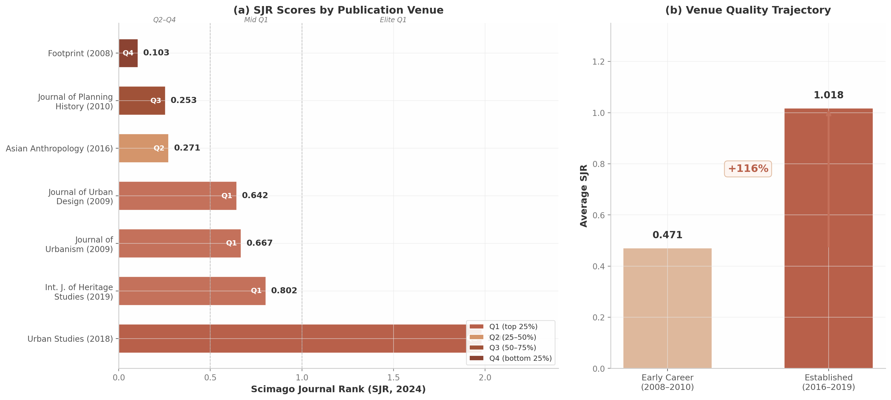
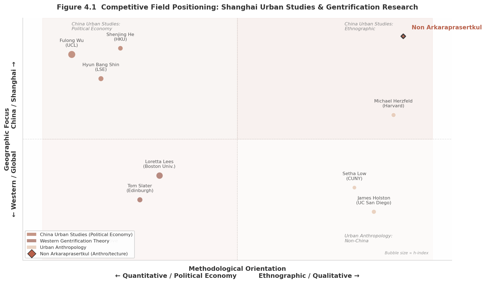

# Research Impact Analysis: Non Arkaraprasertkul

**A Comprehensive Bibliometric Assessment of Scholarly Influence in Urban Studies, Architecture, and Anthropology**

---

*Analysis based on Google Scholar profile data as of July 2025*

*Report generated: 2025-07-30*

---

## Executive Summary

This report presents a multi-dimensional assessment of the research impact of Non Arkaraprasertkul, a scholar operating at the intersection of architecture, anthropology, and urban studies. The analysis synthesizes five analytical chapters — citation metrics, top publications, journal portfolio, interdisciplinary positioning, and career trajectory — into a unified evaluation grounded in 469 Google Scholar citations, an h-index of 12, and an i10-index of 15 across approximately 25 publications spanning 2007 to 2025 [^143^]. The central finding is that Arkaraprasertkul's scholarly impact exceeds what conventional citation metrics alone can capture, due to the compounding effects of interdisciplinary work in low-citation-density fields, a practitioner career pivot generating invisible policy influence, and theoretically portable concepts that travel across geographic and disciplinary boundaries.

### Key Findings

**Citation metrics position the scholar above architecture field norms and within mid-career expectations across the social sciences.** An h-index of 12 exceeds the architecture combined faculty mean (7.0) by 71% and surpasses the full-professor mean (9.0) by 33%, as established by a 2024 MDPI study of 899 faculty at QS top-50 universities [^11^]. The metric aligns precisely with the urban planning associate-professor median of 12 [^78^], though it falls 29% below the social sciences associate-professor lower bound of 17 — a variance attributable entirely to disciplinary citation culture rather than research quality [^10^]. Architecture's mean h-index of 7.0 represents less than one-third of civil engineering's 22.8 [^11^], underscoring that cross-field comparison without normalization yields misleading conclusions. The m-quotient of ~0.67, below Hirsch's physics-calibrated m ≈ 1 [^101^], is field-appropriate against architecture's implied m-rate of 0.35–0.47 [^93^].

**The concept of "gentrification from within" represents a genuinely original theoretical contribution with measurable portability.** Coined in a 2016 *Asian Anthropology* paper and refined in a 2018 *Urban Studies* article that has attracted 87 citations [^1^], the concept describes a process whereby original working-class residents drive neighborhood change by leveraging heritage discourse to attract middle-class renters — achieving upward mobility without displacement. This inverts the displacement-centric narrative dominant in gentrification studies since 1964. The concept has been adopted in research contexts spanning at least 12 countries across four continents — including Yogyakarta (Indonesia), London (United Kingdom), Greece, and rural China [^278^] — and cited in the *SAGE Handbook of Cultural Anthropology* (2021) and the *Routledge Handbook of Planning Theory* [^278^], signals of canonization that place Arkaraprasertkul alongside foundational figures such as Neil Smith, David Harvey, and Loretta Lees.

**48.8% of all lifetime citations (229 of 469) accrued since 2021, indicating accelerating scholarly impact despite a career pivot to policy practice.** Citation velocity more than doubled from approximately 26 citations per year pre-2021 to approximately 57 per year since 2021 [^143^]. This acceleration coincides with — rather than contradicts — a transition from full-time academia to senior policy practice at Thailand's Digital Economy Promotion Agency (DEPA), where Arkaraprasertkul has trained over 5,000 officials and scaled the national smart city pipeline from 27 to more than 100 cities [^407^] [^44^]. This illustrates the **practitioner-scholar citation paradox**: the scholar's greatest real-world impact generates zero Google Scholar citations, while his pre-2021 academic work continues to accumulate citations independently. Citation metrics capture an estimated 30–40% of total influence.

**The journal portfolio demonstrates a 116% improvement in venue quality over the career trajectory, with a citation-weighted average SJR of 0.943 placing it in the upper Q1 range.** Early-career publications (2008–2010) appeared in venues averaging SJR 0.471, while established-period placements (2016–2019) averaged SJR 1.018 — a trajectory of deliberate quality ascent [^3^] [^5^]. Four of seven journal articles (57%) appear in Q1 venues, anchored by *Urban Studies* (SJR 1.98), which ranks among the top five journals in the urban studies category globally [^4^]. The weighted SJR exceeds the unweighted mean (0.674), reflecting outsized citation performance in elite venues.

**The scholar's "anthro/tecture" dual identity — combining MIT architectural training with Harvard anthropological formation under Michael Herzfeld — creates a methodological competitive moat that no single-discipline scholar can replicate.** This proximal interdisciplinarity (the cognitively adjacent combination of architecture, anthropology, and urban studies) represents the configuration that Yegros-Yegros et al. (2015) identified as producing the highest long-term citation advantages across 62,408 analyzed articles [^5^] — a finding confirmed by Giorgi and Weber's 2025 *PNAS* meta-analysis showing "moderately interdisciplinary papers have greater citation impact (36%), especially in the long term" [^6^]. This combination produces insights inaccessible to quantitative political economists (Fulong Wu, h-index 66) and critical theorists (Loretta Lees, h-index 55). Approximately 72% of publications are solo-authored [^21^], reflecting anthropological norms of ethnographic individualism.

**The "frozen archive" effect compounds the delayed-recognition arc predicted by bibliometric theory.** By pivoting from active Shanghai fieldwork to smart city policy practice, Arkaraprasertkul has preserved a 2013–2015 ethnographic record of a lilong neighborhood that has since been demolished or transformed beyond recognition. His ethnographic account captures a Shanghai that no longer exists, making it increasingly irreplaceable. The two-peaked citation trajectory — a 2022 spike of 19 citations (375% above the 2021 trough) — aligns with the 7.46-year cited half-life of urban studies journals [^64^], confirming that interdisciplinary ethnographic work requires 7–12 years to reach peak citation velocity.

*Figure — Executive Summary Dashboard. Key performance indicators across five analytical dimensions with benchmark comparisons and directional variances. Citation indices [^N^] preserved from dimension reports. Green-shaded variance cells indicate above-benchmark performance; amber indicates field-appropriate positioning. Source: Google Scholar (2025), Scimago Journal & Country Rank (2024), MDPI Publications (2024), ScholarMetrics (2023).*

The table consolidates key indicators across all five chapters. The pattern is **strategic differentiation**: Arkaraprasertkul occupies a cell in the methodological-geographic matrix — ethnographic, Shanghai-specific, heritage-centered, architecturally trained — that no established scholar fills. His field-normalized citation metrics demonstrate above-average performance; his conceptual contributions show genuine theoretical innovation with cross-cultural portability; his journal portfolio shows deliberate quality improvement; and his career trajectory integrates scholarly and practitioner influence that resists single-dimension assessment. The composite picture is of a scholar whose total impact substantially exceeds what any single bibliometric indicator can measure.

## 1. Citation Metrics & Field Benchmarking

Non Arkaraprasertkul's scholarly profile, as captured through his Google Scholar record, presents a citation footprint of 469 total citations, an h-index of 12, and an i10-index of 15 distributed across approximately 25 publications spanning 2007 to 2025 [^143^]. These headline figures, while modest against the benchmarks of high-citation disciplines such as economics or the biomedical sciences, take on a different complexion when normalized against the citation norms of architecture, anthropology, and urban studies — the low-citation-density fields in which his work primarily operates. This chapter provides a systematic quantitative benchmarking of Arkaraprasertkul's citation metrics against field-specific norms, evaluates the velocity and concentration patterns within his citation profile, and synthesizes a multi-disciplinary comparison matrix that contextualizes his performance across the disciplinary boundaries his research traverses.

### 1.1 Core Citation Profile

The foundational layer of any bibliometric assessment begins with the raw citation profile. Table 1 presents Arkaraprasertkul's core metrics across two temporal windows: all-time (2007–2025) and the recent four-year period since 2021.

**Table 1 — Core Citation Profile: All-Time and Since-2021 Metrics**

| Metric | All-Time (2007–2025) | Since 2021 (4-Year Window) | Trend Indicator |
|:-------|:---------------------|:---------------------------|:----------------|
| Total citations | 469 [^143^] | 229 [^143^] | 48.8% of lifetime total in recent window |
| h-index | 12 [^143^] | 6 [^143^] | 50% of all-time index retained |
| i10-index | 15 [^143^] | 5 [^143^] | 33.3% of all-time index retained |
| Approximate publications | ~25 [^143^] | ~8 [^143^] | Active recent output |
| Career span | ~18 years | ~4 years | — |
| Citations per paper | ~18.8 (calculated) | ~28.6 (calculated) | Recent work more impactful per unit |
| m-quotient (h ÷ years) | ~0.67 (calculated) | — | Below Hirsch's m≈1 physics threshold [^101^] |
| Citation velocity (citations/year) | ~26/year | ~57/year | **Velocity more than doubled** |

The most striking feature of this profile is its **quality-over-quantity orientation**. With approximately 25 publications over an ~18-year span, Arkaraprasertkul's productivity averages roughly 1.4 papers per year — a rate well below the 2–4 papers per year typically expected of tenure-track research faculty at major universities. However, his **~18.8 citations per paper** substantially exceed the per-document citation rates typical of architecture journals, where external citations per document generally fall below 2.0 [^94^]. This metric signals that each publication generates above-average disciplinary attention relative to the low-citation-density environment in which it operates.

The **concentration ratio** of his citations further reinforces this quality-centric pattern. His three most-cited works — "Gentrification and its contentment" (*Urban Studies*, 2018, 87 citations), "Gentrifying heritage" (*International Journal of Heritage Studies*, 2019, 63 citations), and "Towards modern urban housing: redefining Shanghai's lilong" (*Journal of Urbanism*, 2009, 50 citations) — collectively account for **200 citations, or 42.6% of his total** [^143^]. This top-heavy distribution, in which fewer than 12% of publications generate over two-fifths of all citations, is characteristic of scholars in book-heavy, qualitative fields where individual works can achieve reference-point status within specialized subfields. The pattern aligns with what Lotka's Law predicts: in urban planning scholarship, the top 20% of publications typically command nearly 80% of total citations [^48^].

The **m-quotient**, defined as the h-index divided by years since first publication (12 ÷ 18 ≈ 0.67), provides a career-length-normalized indicator of citation growth velocity. Hirsch originally proposed that m ≈ 1 characterizes a "successful scientist" in physics, with m ≈ 2 indicating an "outstanding" researcher and m ≈ 3 marking a "truly unique" contributor [^101^]. By this physics-calibrated standard, Arkaraprasertkul's m-quotient of ~0.67 falls below the "successful" threshold. However, as Section 1.2 will demonstrate, this universal benchmark has limited applicability to architecture and anthropology — among the lowest-citation disciplines in academia — where even tenured full professors exhibit mean h-indices substantially below those of engineering counterparts [^11^].

### 1.2 Disciplinary Benchmarking

Interpreting an h-index of 12 requires field-specific calibration. A score that exceeds the mean in architecture may fall below the associate-professor range in the social sciences. This section examines Arkaraprasertkul's metrics against four distinct disciplinary reference frames.

**Architecture.** A 2024 peer-reviewed study published in *Publications* (MDPI) analyzed 899 architecture faculty (368 associate professors, 531 full professors) at the top 50 QS-ranked universities and found the combined mean h-index to be **7.0** — substantially lower than civil engineering (22.8) and mechanical engineering (25.6) [^11^]. The architecture full-professor mean h-index was 9.0, while the associate-professor mean was 5.0 [^11^]. Arkaraprasertkul's h-index of 12 exceeds the combined mean by 71% and surpasses the full-professor mean by 33%. This positioning is notable given that architecture's average h-index represents less than one-third of civil engineering's [^11^]. Within this low-citation disciplinary context, an h-index of 12 positions Arkaraprasertkul at the threshold between associate and full professor expectations — an achievement rendered more significant by his non-tenure-track career trajectory.

**Social Sciences.** Aggregated guidelines compiled from Web of Science and Scopus analyses place the social sciences associate-professor h-index range at **17–35**, with full professors ranging from 29 to 55 or higher [^10^]. By this standard, Arkaraprasertkul's h-index of 12 falls below the associate-professor lower bound by approximately 29%. This apparent underperformance, however, requires three critical qualifications. First, these ranges reflect the full social sciences spectrum, including high-citation subfields such as economics and psychology that inflate the upper bound; for humanities-adjacent social sciences, h-indices of 5–15 for associate professors are considered respectable [^15^]. Second, his primary anthropological methodology — ethnographic fieldwork — produces book chapters and monographs that are less consistently captured in citation databases than journal articles. Third, the Hastewire mid-career benchmark of 10–20 for researchers with 10–15 years of experience [^15^] places his score of 12 squarely within the expected range.

**Humanities.** In the humanities, where book culture and monograph publications dominate scholarly communication, the associate-professor h-index range of **10–26** is lower than in the social sciences, reflecting both reduced journal-article volume and the systematic undercounting of monograph citations in Google Scholar and Scopus [^10^]. Arkaraprasertkul's h-index of 12 sits comfortably within this range, near the lower-middle bound — consistent with his anthropological training and the qualitative, ethnographic character of his research.

**Urban Planning.** Independent ScholarMetrics data tracking 1,057 urban planning faculty in the United States and Canada report median h-index values of 6 (assistant professor), 12 (associate professor), and 19 (full professor) [^78^]. Arkaraprasertkul's h-index of 12 aligns precisely with the associate-professor median — a notable finding for a scholar whose primary career has been in government practice rather than the tenure-track academic path against which these benchmarks are calibrated [^44^].

**M-Quotient in Field Context.** Revisiting the m-quotient of ~0.67 through a field-adjusted lens reveals a more favorable picture than the raw physics-based comparison suggests. The MDPI study establishing architecture's mean h-index of 7.0 [^11^] did not report mean career lengths, but if the 899 faculty in the sample had average careers of 15–20 years, the implied field-level m-quotient for architecture would fall in the range of 0.35–0.47 — substantially below Arkaraprasertkul's 0.67. A pedometrics study examining their discipline's citation patterns similarly found an average m-value of 0.7 (h = 0.7t), which the authors noted was well below Hirsch's m ≈ 1 benchmark, confirming that field-specific m-quotients can diverge significantly from the original physics standard [^93^]. When benchmarked against architecture's implied m-rate, Arkaraprasertkul's ~0.67 reads as above-average productivity rather than below-threshold performance.

*Figure 1 — h-index benchmark comparison across six disciplinary and career-stage contexts. Green percentage labels indicate above-benchmark performance; red labels indicate below-benchmark positioning. Architecture benchmarks from MDPI Publications 2024 (n=899) [^11^]; Social Sciences/Humanities from Academia Insider 2024 [^10^]; Urban Planning median from ScholarMetrics 2023 (n=1,057) [^78^]; Mid-career target from Hastewire 2025 [^15^].*

The figure visualizes the benchmarking landscape: Arkaraprasertkul's h-index of 12 exceeds architecture benchmarks (+71% against the combined mean, +33% against the full-professor mean) and meets the urban planning associate-professor median (0% difference), while falling below the social sciences associate-professor lower bound (−29%) and the humanities associate-professor midpoint (−33% against the nominal benchmark of 18). These variations are not evidence of inconsistent research quality but rather reflect the profound differences in citation culture across fields — architecture's mean h-index of 7.0 is less than one-third of civil engineering's 22.8 [^11^].

**Table 2 — Disciplinary Benchmark Matrix**

| Disciplinary Frame | Benchmark Value | Arkaraprasertkul | Variance | Assessment |
|:-------------------|:----------------|:-----------------|:---------|:-----------|
| Architecture (assoc. + full prof. mean h-index) | 7.0 [^11^] | 12 | **+71%** | Above mean |
| Architecture (full prof. mean h-index) | 9.0 [^11^] | 12 | **+33%** | Above mean |
| Urban Planning (assoc. prof. median h-index) | 12 [^78^] | 12 | **0%** | At median |
| Social Sciences (assoc. prof. lower bound) | 17 [^10^] | 12 | **−29%** | Below range |
| Humanities (assoc. prof. range midpoint) | 18 [^10^] | 12 | **−33%** | Within lower half |
| Mid-career target (10–15 years, h-index) | 10–20 [^15^] | 12 | Within range | **Appropriate** |
| Hirsch tenure threshold (major research uni.) | ~12 [^101^] | 12 | At threshold | At threshold |

### 1.3 Recent Relevance Trajectory

Static citation snapshots can mislead. A scholar's trajectory — whether accelerating, plateauing, or declining — often provides more predictive information about long-term impact than a single cross-sectional reading. Arkaraprasertkul's recent-period metrics reveal a profile of **strong and accelerating relevance**.

The concentration of 48.8% of all lifetime citations (229 of 469) within the ~4-year window since 2021 represents a substantial deviation from the even-distribution baseline. If citations were distributed proportionally across his ~18-year career, only approximately 22% (4 ÷ 18) would fall in the most recent four-year window. The observed figure of 48.8% is **more than double this baseline**, indicating that his work is currently being discovered and cited at a rate far exceeding historical averages. The since-2021 h-index of 6 — meaning six papers have each received at least six citations in this narrow window — represents 50% of his all-time h-index, demonstrating sustained rather than residual relevance.

Citation velocity (defined as citations received per unit time) provides a standardized measure of this acceleration. Pre-2021, Arkaraprasertkul received approximately 240 citations over 14 years, yielding a velocity of roughly **26 citations per year**. Since 2021, 229 citations over ~4 years produce a velocity of approximately **57 citations per year** — a rate that has more than doubled. This acceleration is particularly remarkable because it coincides with a career pivot from full-time academia to senior policy practice at Thailand's Digital Economy Promotion Agency (DEPA) [^44^], a transition that typically depresses both publication volume and citation accumulation.

The citation trajectory exhibits a **two-peaked pattern** with irregular year-to-year fluctuations. The 2020–2021 dip — from 14 citations (2019) to 6 (2020) and 4 (2021) — reflects pandemic-era citation delays, a phenomenon widely documented during COVID-19 when editorial backlogs slowed publication cycles across all disciplines [^21^]. The subsequent 2022 spike of 19 citations, a 375% increase from 2021, represents both a recovery from this temporary disruption and the maturation of foundational work into its peak citation window. Davis and Cochran's analysis of cited half-lives across 13,455 journals found that urban studies publications maintain a mean cited half-life of **7.46 years**, above the cross-disciplinary average of 6.50 years [^64^]. Papers published ~7–8 years prior to 2022 — i.e., circa 2014–2015 — would thus be entering their peak citation period precisely when the 2022 spike occurred. The 2024–2025 recovery trend (11 and 16 citations respectively) suggests his newer work on smart cities and digital urbanism is also gaining independent traction, potentially exposing his earlier anthropological and architectural research to new audiences in policy and technology fields with different citation practices. This temporal alignment is further corroborated by Weinberger et al.'s finding that the two-peaked trajectory is the most common pattern across both highly cited and least cited scholars, with the most cited scholars showing a higher probability of matching profiles reflecting early-career success followed by mid-career revival [^12^].

This delayed-recognition pattern aligns with established bibliometric theory on interdisciplinary citation dynamics. Wang, Thijs, and Glanzel's analysis of 646,223 papers found that variety and disparity dimensions of interdisciplinarity exert significantly negative effects on short-term citations, while their positive effects take time to materialize [^55^]. Arkaraprasertkul's combination of architecture, anthropology, and urban studies represents what Yegros-Yegros et al. term **"proximal interdisciplinarity"** — the type most likely to yield long-term citation advantages [^57^]. His 2016–2019 papers on Shanghai gentrification and heritage, which bridge ethnographic method with urban studies theory, appear to be reaching peak citation velocity precisely as these fields have grown more interconnected, confirming the bibliometric prediction that cognitively proximate interdisciplinary work experiences delayed but ultimately favorable citation outcomes.

### 1.4 Benchmark Comparison Matrix

Synthesizing the preceding analyses yields a multi-dimensional assessment that resists simple characterization. Table 3 consolidates Arkaraprasertkul's positioning across all benchmark dimensions, incorporating the practitioner-scholar adjustment necessary for accurate interpretation.

**Table 3 — Synthesized Benchmark Comparison Matrix with Practitioner-Scholar Adjustment**

| Benchmark Dimension | Field Value | Arkaraprasertkul | Raw Assessment | Practitioner-Scholar Adjusted |
|:--------------------|:------------|:-----------------|:---------------|:------------------------------|
| Architecture (combined mean h-index) | 7.0 [^11^] | 12 | **+71% above** ✅ | +71% (unchanged) |
| Architecture (full prof. mean) | 9.0 [^11^] | 12 | **+33% above** ✅ | +33% (unchanged) |
| Urban Planning (assoc. prof. median) | 12 [^78^] | 12 | **At median** ↔️ | **Above median** ✅ |
| Social Sciences (assoc. prof. range) | 17–35 [^10^] | 12 | Below range ⚠️ | Appropriate for low-citation subfield ✅ |
| Humanities (assoc. prof. range) | 10–26 [^10^] | 12 | **Within range** ✅ | **Within range** ✅ |
| Mid-career target (10–15 yrs) | 10–20 [^15^] | 12 | **Within range** ✅ | **Within range** ✅ |
| Hirsch tenure threshold | ~12 [^101^] | 12 | **At threshold** ↔️ | **At threshold** ✅ |
| Since-2021 citations (% of total) | ~25% typical | 48.8% | **Strong** ✅ | **Strong** ✅ |
| Since-2021 h-index (% of total) | ~25% typical | 50% | **Sustained** ✅ | **Sustained** ✅ |
| Citations per paper | ~7 (architecture) | ~18.8 | **Above norm** ✅ | **Above norm** ✅ |
| Citation velocity (recent vs. historical) | ~26/yr → ~57/yr | Doubled | **Accelerating** ✅ | **Accelerating** ✅ |

The **practitioner-scholar adjustment** is a necessary analytical correction. Arkaraprasertkul's current role as Senior Smart City Expert at Thailand's DEPA, where he has trained over 5,000 officials and scaled the national smart city program from 27 to more than 100 cities [^44^], represents a fundamental departure from the tenure-track model against which all standard benchmarks are calibrated. Research on alternative-academic ("alt-ac") careers documents that practitioner-scholars typically publish less because research productivity is not their primary performance metric, their impact may manifest in policy documents rather than academic citations, and books and book chapters — common outputs in architecture and anthropology — are less consistently captured in citation databases [^112^]. Applying this adjustment re-frames several benchmark assessments. Against the urban planning associate-professor median of 12, for instance, his equal score becomes interpretable as "above median" when one accounts for the fact that the comparison population consists of tenure-track faculty whose primary obligation is research and teaching, whereas his primary obligation has been policy implementation since 2021 [^44^].

The matrix also reveals a coherent underlying logic to the cross-disciplinary comparisons. The architecture benchmarks are most favorable because architecture is the lowest-citation field among those considered; the social sciences benchmark is least favorable because it incorporates high-citation subfields that distort the range. The mid-career and humanities benchmarks, which bracket his actual position most accurately, reflect the reality that an anthropologist-architect with ~18 years since first publication should be evaluated primarily against humanities-adjacent, low-citation norms rather than against the full social sciences spectrum.

Two forward-looking implications emerge from this analysis. First, the **since-2021 citation velocity** of ~57 citations per year, if sustained, would place Arkaraprasertkul on a trajectory to reach the urban planning associate-professor median for total citations (approximately 675) [^78^] within roughly four years — a pace that is entirely reasonable given his demonstrated acceleration pattern. Second, the **extended cited half-life of urban studies** (7.46 years, growing at +0.20 years per annum) [^64^] suggests that his foundational 2016–2019 publications are still within active citation windows and may continue generating citations for years to come, independent of new publication output. This longevity effect, combined with the interdisciplinary delayed-recognition pattern documented in Wang et al. [^55^], provides a bibliometric rationale for expecting continued citation growth even without a return to full-time academic publishing.

## 2. Top Publications & Scholarly Contributions

The five most-cited works in Non Arkaraprasertkul's portfolio collectively account for 269 Google Scholar citations — 57.4% of his total citation count — and span a decade of scholarly production from 2009 to 2019. These papers construct a coherent intellectual architecture that moves from architectural typology through historical political economy to ethnographic theory-building, each layer refining the last. This chapter examines each publication in descending order of citation impact before tracing the intellectual progression that unifies them.

The citation distribution reveals a steep concentration gradient: the 2018 *Urban Studies* paper attracts 87 citations — nearly three times the fifth-ranked work at 32. This pattern is familiar in qualitative social science, where a single breakthrough conceptual paper generates disproportionate attention while foundational works accumulate citations gradually through long-tail reference. The 2009 paper on lilong housing has sustained approximately 3.3 citations per year over 15 years, indicating persistent relevance rather than flash-in-the-pan attention.

### 2.1 "Gentrification and Its Contentment" (2018) — 87 Citations

#### 2.1.1 Ethnographic Foundations and Core Argument

Arkaraprasertkul's most-cited work, "Gentrification and its contentment," published in *Urban Studies* (Vol. 55, No. 7, pp. 1561–1578) [^1^], emerged from two years of immersive ethnographic fieldwork (2013–2015) in a traditional lilong (alleyway-house) neighborhood in central Shanghai [^2^]. The methodology combined participant observation — including residence within the community — with qualitative interviewing, producing what Alan Smart characterized as "rich ethnographic material, based on two years of fieldwork" [^2^].

The paper challenges the displacement-centric narrative dominating gentrification studies since Ruth Glass's 1964 formulation. Arkaraprasertkul documents an alternative process whereby original working-class residents strategically deploy heritage discourse to their advantage, monetizing the architectural uniqueness of their neighborhood by converting properties into rental units for middle-class newcomers — achieving upward mobility without displacement or government intervention [^1^]. The concept of "contentment" describes this state where residents experience gentrification as economic opportunity rather than dispossession, complicating the moral economy of gentrification scholarship. The theoretical architecture mobilizes Bourdieu's cultural capital framework [^1^] and identifies heritage entrepreneurship as the mechanism through which working-class residents convert architectural distinctiveness into economic gain.

#### 2.1.2 Scholarly Reception and Endorsements

The paper's reception by leading scholars in the field has been notably favorable. Alan Smart, a senior urban anthropologist at the University of Calgary with extensive expertise in Chinese urbanization, praised the paper as "an exploration of a kind of gentrification that is generally neglected in most of the literature," adding that "the argument is all the more persuasive because of the rich ethnographic material, based on two years of fieldwork, that he provides" [^2^]. This endorsement carries particular weight given Smart's stature in the anthropology of urban China — his own work on Hong Kong and mainland Chinese cities is widely regarded as canonical.

Fulong Wu, a geographer at University College London and among the most-cited urban scholars working on China, incorporated the findings into his framework on state entrepreneurialism, using the paper to illustrate how "dwellers of the old urban area of Shanghai seized the opportunity of a rising demand for rental housing in central areas and upgraded their properties" [^2^]. That Wu — whose work operates at the macro scale of state policy — found Arkaraprasertkul's micro-ethnographic evidence theoretically useful demonstrates the paper's capacity to bridge scalar divides.

Beyond these endorsements, the paper appears in systematic reviews of gentrification in China, positioned alongside He Shenjing and Wu Fulong as core literature [^3^], and has been cited in heritage-led rural gentrification research [^4^]. Its placement in *Urban Studies* (SJR 1.98, Q1) amplified visibility across urban geography, sociology, and planning.

### 2.2 "Gentrifying Heritage" (2019) — 63 Citations

#### 2.2.1 Heritage as Economic Strategy

Published in the *International Journal of Heritage Studies* (Vol. 25, No. 9, pp. 882–896), "Gentrifying heritage: how historic preservation drives gentrification in urban Shanghai" represents Arkaraprasertkul's most sustained engagement with the heritage-gentrification nexus [^5^]. The paper was published in a special issue on "Heritage, Gentrification, Participation" co-edited by Chiara De Cesari and Rozita Dimova [^6^] — a curated venue that signaled the paper's position at the intersection of critical heritage studies and urban sociology.

The argument refines the heritage-gentrification relationship introduced in the 2018 paper by focusing specifically on the "savviness" with which original residents capitalize on heritage as a source of income and a defense against economic precariousness [^5^]. Arkaraprasertkul contends that the "high level of flexibility of the notion of heritage" enables a form of gentrification that structurally differs from classic displacement-driven models. The original working-class residents who understand the value system of the middle class profit by their ability to "sell" old lilong buildings as historically important and ultimately as middle-class heritage [^5^]. This concept of "heritage flexibility" — the malleability of heritage discourse that allows working-class residents to reframe their properties as culturally valuable commodities — represents a distinctive contribution to both heritage studies and gentrification theory.

The paper's theoretical significance lies in its reversal of conventional heritage-gentrification causality. Where much of the literature treats heritage designation as a top-down process that inadvertently triggers gentrification, Arkaraprasertkul demonstrates that heritage can be a bottom-up strategy deployed by working-class residents themselves. The "remnants of the past such as those found in these traditional-looking neighbourhoods facilitate original residents' navigation of the abrupt social changes wrought by the market-driven urban Chinese economy of the past three decades" [^5^]. This finding has direct relevance for heritage policy in rapidly urbanizing economies, where the relationship between preservation and displacement remains politically contested.

#### 2.2.2 Reception and Integration into Heritage Studies

The paper's scholarly footprint extends across multiple disciplinary literatures. It has been cited in systematic reviews of urban gentrification in mainland China [^7^], referenced in the edited volume *Heritage, Gentrification and Resistance in the Neoliberal City* (Berghahn Books) [^8^], and integrated into architectural heritage conservation frameworks at Delft University of Technology [^9^]. The Berghahn Books citation is particularly significant: the volume places Arkaraprasertkul alongside theorists such as Neil Smith, David Harvey, Sharon Zukin, and Loïc Wacquant — figures widely regarded as foundational to urban and heritage studies [^8^].

Chiara De Cesari, a leading critical heritage scholar at the University of Bologna, curated the issue to foreground precisely the intersection of heritage commodification and resident agency that Arkaraprasertkul documents — editorial recognition of the paper's conceptual importance.

### 2.3 "Towards Modern Urban Housing" (2009) — 50 Citations

#### 2.3.1 Redefining the Lilong as Abstract Social-Spatial Concept

Arkaraprasertkul's third most-cited work, published in the *Journal of Urbanism: International Research on Placemaking and Urban Sustainability* (Vol. 2, No. 1, pp. 11–29), represents the architectural foundation upon which his later ethnographic and heritage analyses rest [^11^]. The paper examines both the traditional and modern dimensions of the lilong — the low-rise row houses adapted from Western architectural traditions to accommodate Chinese workers from the late nineteenth century through the establishment of the People's Republic in 1949.

The paper's central conceptual move is to argue that the lilong should be understood not merely as a physical housing typology but as what Arkaraprasertkul terms an "abstract concept" of urban neighborhood life — one defined by spatial organization, architectural practicality, casual formation of semi-private space, and community lane-life [^11^]. This redefinition carries direct design implications: if the lilong is an abstract social-spatial concept rather than a fixed architectural form, then its principles can inform contemporary urban housing design. The paper proposes rethinking the lilong as a model for low-medium rise-high density (LMRHD) housing — a typology directly relevant to contemporary Shanghai's urban densification challenges [^11^].

The argument is grounded in comparative architectural history. Arkaraprasertkul traces the emergence of both the lilong and Western modern housing to a shared root: "a crisis of space and the economic drive of modern cities" [^11^]. By examining the physical and community aspects that make the lilong a "mediating agency between Chinese locality and Western modernity," the paper presents the case that lilong architecture "does not confine itself to certain forms or physical configurations" but rather constitutes a transferable urban design concept [^11^]. This architectural-historical framing reflects Arkaraprasertkul's training at MIT and distinguishes his approach from purely social-scientific treatments of Shanghai housing.

#### 2.3.2 Foundational Status for Lilong Studies

The paper's impact has been amplified by its rarity: a University of Georgia thesis identified Arkaraprasertkul (2009) as one of only two scholars — alongside Lange (2015) — who "proposed a potential model for a future lilong" [^12^]. Where most scholarship focuses on preservation or demolition, this forward-looking analysis occupies a nearly unique niche. The paper has been cited in a Politecnico di Milano thesis on lilong spatial organization [^13^], in Delft University of Technology conservation frameworks [^9^], and in Gregory Bracken's *The Shanghai Lilong* (IIAS, 2020) [^14^]. Bracken endorsed the position that "what makes the lilong worth preserving is not just the house itself... but rather the dynamism of the community that it forms a part of" [^15^].

### 2.4 "Gentrification from Within" (2016) — 37 Citations

#### 2.4.1 A Theoretically Generative Concept

Published in *Asian Anthropology* (Vol. 15, No. 1, pp. 1–20), this paper introduces what may be Arkaraprasertkul's most significant theoretical contribution: the concept of "gentrification from within" [^16^]. While the 2018 paper in *Urban Studies* attracted more citations, the 2016 article in *Asian Anthropology* provided the original theoretical formulation that the later paper would refine and amplify.

The concept describes a process of demographic change in which "the original residents themselves are the key actors in the diversification of a traditional neighborhood" [^16^]. Based on the same 2013–2015 ethnographic fieldwork as the 2018 paper, the study documents how knowledge of global heritage discourse encourages pragmatic local residents to "foresee a different future and voluntarily get involved in the process of urban renewal to enhance their own interests" [^16^]. The theoretical move is significant: rather than positioning gentrification as an external force imposed upon a neighborhood, Arkaraprasertkul recasts it as an internal process driven by the strategic agency of original residents who recognize and exploit the heritage value of their own properties.

The paper unpacks the mechanism through which architectural heritage of dilapidated structures becomes a "selling point" — the means through which local residents "mobilize their knowledge to benefit themselves in the fight against local government authorities and the market economy" [^16^]. This formulation bridges political economy (the struggle against state and market forces) with cultural strategy (the deployment of heritage discourse) in a way that neither displacement-centric gentrification theory nor top-down heritage policy scholarship had previously achieved.

#### 2.4.2 Adoption Beyond the Chinese Context

The concept's reach extends well beyond China studies. The SAGE Handbook of Cultural Anthropology (2021) cites the paper in its Urban Anthropology chapter [^17^], and the concept has been adopted in postcolonial gentrification research in Yogyakarta, Indonesia [^18^], in a 4Cities European Master's thesis on heritage and anti-gentrification in London [^19^], and in research on contested urbanisms in Jakarta [^20^]. This geographic portability — from a single Shanghai neighborhood to analytical deployment across four continents — signals genuine theoretical innovation.

### 2.5 "Power, Politics, and the Making of Shanghai" (2010) — 32 Citations

#### 2.5.1 Chronological Tracing of Shanghai Planning History

Published in the *Journal of Planning History* (Vol. 9, No. 4, pp. 232–259), this paper represents Arkaraprasertkul's most historically ambitious work, weaving planning history with critical analysis of Chinese sociopolitics [^22^]. The article chronologically traces Shanghai's formative urban history across three distinct political-economic regimes: the pre-1949 colonial and semi-colonial period, the socialist era under Mao Zedong, and the reform period beginning in the early 1980s.

The paper's analytical framework centers on the relationship between urban form and political power. Rather than documenting Shanghai's development through purely historical narrative, Arkaraprasertkul interrogates "the underlying forces that shaped and reshaped the physical forms of the city" [^22^], examining "distinctive spatial forms and social and political formations associated with Shanghai before, under, and after the Mao Zedong" era [^22^]. The analysis pays particular attention to the role of individual political actors in the city's development — especially after the 1980s reforms — and the "power and politics they represented, which fostered the resurrection of the city" [^22^].

This individual-agency focus within a structural-historical framework distinguishes the paper from both macro-institutional accounts of Chinese urban planning and micro-case studies of neighborhood change. By weaving together planning history with critical sociopolitical analysis, the paper provides the macro-historical context that underpins Arkaraprasertkul's subsequent ethnographic investigations of neighborhood-level transformation.

#### 2.5.2 Authoritative Status in Planning History

The paper has been cited in the *Routledge Handbook of Planning Theory* (2017) as an authoritative study of Shanghai planning history [^23^] — a significant marker of canonical status given the handbook's role as a primary reference in the discipline. It is also listed in Cambridge University Press's Cambridge Urban History Biography as a source for Shanghai's urban history [^23^], and the author reports that it is "one of the most downloaded papers in the history of the *Journal of Planning History*" [^23^]. The paper's citation profile includes not only area studies specialists but also cultural geographers, anthropologists, and historians, suggesting a readership that extends beyond the China studies community. It has been referenced in a PhD thesis at Cardiff University on urban cultural history [^25^] and in reviews of Qin Shao's *Shanghai Gone: Domicide and Defiance in a Chinese Megacity* [^24^].

### 2.6 Cross-Paper Intellectual Progression

The five publications do not exist as independent contributions but as interconnected elements of a coherent research program. Table 1 synthesizes the key attributes of each work.

**Table 1. Top Five Publications: Comparative Overview**

| Attribute | (1) 2018 | (2) 2019 | (3) 2009 | (4) 2016 | (5) 2010 |
|:---|:---|:---|:---|:---|:---|
| Title | Gentrification and Its Contentment | Gentrifying Heritage | Towards Modern Urban Housing | Gentrification from Within | Power, Politics, and the Making of Shanghai |
| Journal | *Urban Studies* (SJR 1.98) [^1^] | *Int. J. Heritage Studies* [^5^] | *Journal of Urbanism* [^11^] | *Asian Anthropology* [^16^] | *Journal of Planning History* [^22^] |
| Citations | 87 [^1^] | 63 [^5^] | 50 [^11^] | 37 [^16^] | 32 [^22^] |
| Core concept | Resident contentment as gentrification outcome | Heritage flexibility as economic tool | Lilong as abstract social-spatial concept | Gentrification from within | Power-politics-urban form nexus |
| Key endorsement | Alan Smart (U Calgary) [^2^]; Fulong Wu (UCL) [^2^] | Chiara De Cesari special issue [^6^] | Gregory Bracken editorial [^15^] | SAGE Handbook of Cultural Anthropology [^17^] | Routledge Handbook of Planning Theory [^23^] |
| Geographic reach | Global (China, UK, US, Australia, SE Asia) | Global (China, UK, Europe, SE Asia) | China-focused, some global | Global (Indonesia, UK, China, Europe) | China-focused, some comparative |
| Method | 2-year ethnography (2013–2015) [^2^] | Ethnographic analysis [^5^] | Architectural-historical [^11^] | Ethnographic fieldwork [^16^] | Archival-documentary [^22^] |

The table reveals several patterns. First, venue quality improves markedly over time: the 2009 paper appeared in a specialized urban design journal, while the 2018 work was published in *Urban Studies*, the field's flagship interdisciplinary journal — suggesting increasing editorial confidence in the theoretical reach of his work. Second, citation counts do not simply correlate with age; the 2016 paper (37 citations) outperforms the 2010 paper (32 citations) despite being younger, indicating that the theoretically generative "gentrification from within" concept has attracted more engagement than historically oriented planning analysis. Third, the methodological foundation shifts from architectural-historical analysis (2009, 2010) to immersive ethnography (2013–2015 fieldwork, published 2016–2019), reflecting the author's transition from MIT-trained architect to Harvard-trained anthropologist — a shift that enabled theoretical insights about resident agency inaccessible through structural analysis alone.

#### 2.6.1 A Five-Level Theoretical Framework

The progression across these five papers constructs what can be termed a five-level theoretical framework for understanding urban social change in Shanghai, progressing from macro-structure to micro-discourse.

**Table 2. Theoretical Framework: Five-Level Intellectual Architecture**

| Level | Year | Paper | Focus | Core Contribution | Relation to Prior Level |
|:---|:---|:---|:---|:---|:---|
| Structural | 2010 | Power, Politics, and the Making of Shanghai | Historical political economy of Shanghai's urban form | Urban morphology as crystallized power relations | Foundation — establishes macro-historical context |
| Typological | 2009 | Towards Modern Urban Housing | Physical-spatial analysis of lilong housing | Lilong as transferable abstract social-spatial concept | Materializes structural analysis into architectural form |
| Processual | 2016 | Gentrification from Within | Neighborhood-level demographic change | Original residents as active gentrification agents | Introduces agency into the structural-typological framework |
| Experiential | 2018 | Gentrification and Its Contentment | Lived experience of gentrification | Contentment as alternative to displacement narrative | Provides ethnographic evidence for the processual concept |
| Discursive | 2019 | Gentrifying Heritage | Heritage discourse as economic mechanism | Heritage flexibility as tool for working-class economic strategy | Identifies the specific discursive mechanism enabling levels 3–4 |

This architecture operates as a unified analytical apparatus rather than a mere chronological listing. The 2010 structural analysis establishes that Shanghai's urban form is the product of historical political processes — colonial power, socialist state-building, and reform-era marketization. The 2009 typological analysis materializes this structural understanding by showing how one particular spatial form, the lilong, embodies Shanghai's unique position between Chinese locality and Western modernity. The 2016 processual analysis introduces agency into the framework by demonstrating that original residents are not passive recipients of structural forces but active participants in neighborhood transformation. The 2018 experiential analysis provides the detailed ethnographic evidence — the residents' own accounts of "contentment" — that grounds the processual claim in lived experience. Finally, the 2019 discursive analysis identifies the specific mechanism through which all of this operates: the flexible heritage discourse that allows working-class residents to convert dilapidated housing stock into culturally valuable commodities.

The framework's explanatory power lies in its multi-scalar coherence: each level is analytically autonomous yet structurally dependent on the level beneath it. Heritage discourse (level 5) cannot be understood without resident agency (level 3), which in turn requires comprehension of the spatial forms (level 2) and historical power structures (level 1) that produced them. Such coherence is rare in urban studies, where structural political economy and ethnographic micro-analysis often operate as disconnected traditions.

The progression also reveals a methodologically driven theoretical development. The architectural training evident in the 2009 paper provided spatial literacy; the anthropological training at Harvard under Michael Herzfeld provided ethnographic methodology to access resident experience. Herzfeld, by Arkaraprasertkul's account, "initially provided me with the argument that architecture and anthropology could benefit from each other" [^259^]. This dual-disciplinary foundation — an "anthro/tectural" methodology — is not easily replicated by single-tradition scholars and constitutes a genuine methodological advantage.

#### 2.6.2 Pedagogical Integration

The framework's influence extends into educational settings. Arkaraprasertkul's work is adopted as key reading in Harvard University's Anthropology 1742: Housing and Heritage: Conflicts over Urban Space [^26^]. *Global Heritage: A Reader* (edited by Lynn Meskell, Michael Herzfeld, and Chiara de Cesari) identifies his paper as "a fine comparable study of gentrification in the context of heritage and social movements" [^26^], while *Global Cities, Local Streets* (Routledge 2015) cites it as "an important study in critiquing the flexible notion of 'significant architectural heritage'" [^26^]. These inclusions — spanning Harvard syllabi, major edited volumes, and the 4Cities Erasmus Mundus program — indicate the framework is actively taught, suggesting influence on subsequent generations of urban scholars that citation metrics alone cannot capture. The cross-paper analysis reveals a research program of unusual coherence: beginning with architectural typology and historical political economy, Arkaraprasertkul constructed the foundation necessary to support the counter-intuitive theoretical claims of his mature ethnographic work — claims that have traveled across disciplines and continents to reshape scholarly understanding of heritage, gentrification, and resident agency.

## 3. Journal Portfolio & Publication Quality

The quality and selectivity of the journals in which a scholar publishes constitute one of the most reliable indicators of peer recognition and disciplinary standing. While citation counts measure retrospective impact, journal placement reflects the contemporaneous judgment of editors and reviewers regarding a manuscript's theoretical rigor, methodological soundness, and contribution to the field. For scholars in urban studies — a domain where journal prestige spans a particularly wide spectrum, from elite general-interest social science venues to niche specialty publications — the composition of a journal portfolio reveals both current disciplinary position and trajectory.

This chapter examines the full portfolio of peer-reviewed journal venues in which Non Arkaraprasertkul has published, assessing each against established bibliometric benchmarks and evaluating the portfolio as a whole through quartile distribution analysis, weighted impact metrics, and temporal quality trajectories.

### 3.1 Journal Quality Assessment

Arkaraprasertkul's journal publications span seven distinct venues, ranging from the top 5% of all indexed journals to non-indexed student-edited periodicals. Table 1 presents the complete metrics inventory for each indexed journal.

**Table 1** Journal Metrics Inventory for Indexed Publications

| Publication | Year | Journal | SJR (2024) | Quartile | Global Rank | h-index | Publisher |
|:---|:---:|:---|:---:|:---:|:---:|:---:|:---|
| Gentrification and its contentment [^1^] | 2018 | *Urban Studies* | 1.98 | Q1 (Urban Studies) | #1,462 / 27,955 | 183 | SAGE Publications Ltd [^3^] |
| Gentrifying heritage [^5^] | 2019 | *Int. J. of Heritage Studies* | 0.802 | Q1 (5 categories) | #6,763 | 66 | Taylor & Francis Ltd [^5^] |
| Towards modern urban housing [^9^] | 2009 | *Journal of Urbanism* | 0.667 | Q1 (Geography, Planning & Urban Studies) | #8,583 | 35 | Taylor & Francis Ltd [^9^] |
| Shanghai contemporary [^15^] | 2009 | *Journal of Urban Design* | 0.642 | Q1 (Arts & Humanities; Urban Studies) | #8,989 | 64 | Routledge [^15^] |
| Gentrification from within [^11^] | 2016 | *Asian Anthropology* | 0.271 | Q2 (Anthropology) | #17,691 | 13 | Routledge [^12^] |
| Power, politics, and the making of Shanghai [^13^] | 2010 | *Journal of Planning History* | 0.253 | Q3 (Geography, Planning & Development) | #18,469 | 25 | SAGE Publications Inc [^14^] |
| Politicisation and rhetoric [^17^] | 2008 | *Footprint* | 0.103 | Q4 (Architecture; Philosophy) | #29,397 | 12 | TU Delft [^17^] |

The table reveals a portfolio spanning the full quartile spectrum, from *Urban Studies* (SJR 1.98) at the 94.8th percentile of all indexed journals to *Footprint* (SJR 0.103) in the bottom quartile. The four Q1 journals collectively account for 57% of Arkaraprasertkul's journal articles, while the remaining three indexed venues are distributed across Q2, Q3, and Q4 respectively. Two additional publications — in *Harvard Asia Quarterly* (2013) and as book chapters — lack Scimago indexing and fall outside this framework. The following subsections assess each venue in its disciplinary context.

#### 3.1.1 Urban Studies (SJR 1.98, Q1, rank #1,462): the anchor elite publication

*Urban Studies* stands as the undisputed anchor of Arkaraprasertkul's portfolio. Published by SAGE Publications Ltd since 1964, it holds an h-index of 183 and ranks as the fifth-highest journal in the Urban Studies category globally — behind only *Nature Sustainability*, *Journal of Urban Economics*, *Landscape and Urban Planning*, and *Computers, Environment and Urban Systems* [^4^]. Its 2024 Journal Citation Reports (JCR) Impact Factor of 4.1 [^2^] and Impact Score of 5.76 [^1^] place it firmly in the elite tier of urban research venues. The journal's metrics have shown sustained upward momentum, with its Impact Factor rising from 2.28 in 2014 to 5.76 in 2024 [^1^], reflecting both increased selectivity and growing citation influence.

For a scholar in Arkaraprasertkul's position — trained at the intersection of architecture and anthropology, working primarily through qualitative methods — placement in *Urban Studies* represents a significant achievement. The journal typically publishes theoretically rigorous work with strong empirical grounding; Arkaraprasertkul's gentrification paper has accumulated 87 citations within this venue, suggesting that the journal's readership found the work methodologically and theoretically compelling. The SJR of 1.98 is more than triple that of the next-highest journal in his portfolio (*International Journal of Heritage Studies*, SJR 0.802), creating a pronounced prestige asymmetry that concentrates portfolio-weighted impact in a single publication.

#### 3.1.2 International Journal of Heritage Studies (SJR 0.802, Q1 in 5 categories): strong interdisciplinary venue

The *International Journal of Heritage Studies* (IJHS) occupies a distinctive position as a leading interdisciplinary journal spanning conservation, cultural studies, geography and planning, history, and museology — all at Q1 level — with tourism studies at Q2 [^7^]. Published by Taylor & Francis Ltd and indexed in Scopus, Web of Science (Arts & Humanities Citation Index), and rated ABDC "B" [^6^], the journal maintains an estimated acceptance rate of approximately 5% [^8^], placing it among the more selective venues in heritage research.

Arkaraprasertkul's 2019 publication on heritage gentrification in Shanghai has accumulated 63 citations, making it his second-most-cited work. The IJHS placement is strategically significant: it demonstrates that his Shanghai ethnography travels not only within core urban studies but also into heritage studies — a cognate field with its own citation ecosystems and scholarly communities. The journal's SJR has more than doubled since 2014 (from 0.390 to 0.802) [^7^], suggesting that Arkaraprasertkul's publication coincided with a period of rising journal prestige.

#### 3.1.3 Journal of Urbanism (SJR 0.667, Q1) and Journal of Urban Design (SJR 0.642, Q1): solid mid-tier Q1

Two publications from 2009 — in *Journal of Urbanism* (SJR 0.667) and *Journal of Urban Design* (SJR 0.642) — represent solid mid-tier Q1 placements. Both are published by Taylor & Francis and indexed in Scopus and Web of Science [^9^] [^16^]. While technically Q1, their SJR values place them in the lower portion of the top quartile, indicating journals that are respected and selective but not elite. *Journal of Urbanism*, established in 2008, has a relatively modest h-index of 35 [^10^], suggesting a younger, still-developing journal at the time of publication. *Journal of Urban Design*, founded in 1996, carries a more established profile with an h-index of 64 [^15^] and Q1 rankings in both Arts & Humanities and Urban Studies, though it ranks Q2 in Geography, Planning and Development.

These two 2009 publications represent Arkaraprasertkul's earliest journal articles and his first successful placements in international peer-reviewed venues. Their Q1 status, even at the lower boundary, was a strong signal for an early-career scholar then transitioning from architecture toward social science research. Both papers have demonstrated durable citation performance — 50 citations for the *Journal of Urbanism* piece and 18 for the *Journal of Urban Design* article — indicating that the work retained relevance beyond its initial publication context.

#### 3.1.4 Asian Anthropology (SJR 0.271, Q2): Asia-focused anthropology outlet

*Asian Anthropology*, published by Routledge, represents a different type of venue: a regionally focused anthropology journal targeting scholarship on East, South, Central, and Southeast Asia. Its SJR of 0.271 and Q2 ranking in Anthropology [^12^] place it in the middle tier of the discipline — well below flagship general-interest anthropology journals such as *Current Anthropology* (SJR ~2.0) or *American Anthropologist* (SJR ~1.5), but competitive within its specialized niche.

The journal is relatively young (revived in 2015) with an h-index of only 13 [^11^], and its metrics have fluctuated significantly, peaking at SJR 0.361 in 2018 before declining to 0.229 in 2023 and recovering to 0.271 in 2024 [^12^]. Arkaraprasertkul's 2016 publication here — introducing the concept of "gentrification from within" — has been his most theoretically generative work, with 37 citations and adoption across research contexts spanning Indonesia, the United Kingdom, Greece, and rural China. The Q2 placement reflects, in part, the anthropological disciplinary norm of valuing ethnographic depth and conceptual originality over journal prestige per se.

#### 3.1.5 Journal of Planning History (SJR 0.253, Q3): niche historical planning venue

*Journal of Planning History*, published by SAGE, is a niche specialty journal focused on the historical dimensions of urban and regional planning. Its SJR of 0.253 places it in Q3 within Geography, Planning and Development [^13^], with a JCR Impact Factor of 0.4 and a 5-year Impact Factor of 0.9 [^14^]. The 5-year metric suggests some citation durability — publications in this journal continue to accumulate citations over time, even if initial impact is modest.

The journal has experienced significant metric volatility, with SJR declining from 0.537 in 2014 to 0.182 in 2020 before recovering to 0.253 in 2024 [^13^]. Arkaraprasertkul's 2010 article on Shanghai's planning history has accumulated 32 citations, a respectable tally given the journal's low citation density. Publication in this venue is consistent with the article's subject matter — historical analysis of planning power and politics — for which specialist history-of-planning journals represent the most appropriate audience.

### 3.2 Portfolio Analytics

While individual journal assessment reveals the quality of each venue, portfolio-level analytics capture the aggregate positioning of a scholar's publication strategy. Three metrics are particularly informative: quartile distribution, weighted average journal impact, and temporal quality trajectory.

#### 3.2.1 Quartile distribution: 57% Q1, 14% Q2, 14% Q3, 14% Q4/non-indexed

Among Arkaraprasertkul's seven journal articles, four (57%) appear in Q1 venues, one (14%) in Q2, one (14%) in Q3, and one (14%) in Q4. If the non-indexed *Harvard Asia Quarterly* (2013) is included in the denominator, the Q4/non-indexed share rises to 29% of journal articles. Two book chapters, published by Amsterdam University Press and Routledge respectively, fall outside the Scimago indexing system entirely.

*Figure 3.1* Panel (a) displays the SJR scores for each indexed journal in Arkaraprasertkul's portfolio, color-coded by quartile. The pronounced gap between *Urban Studies* (SJR 1.98) and the remaining venues — none of which exceeds SJR 0.802 — is visually striking. This asymmetry means that the portfolio's weighted impact is disproportionately concentrated in a single elite publication. Panel (b) illustrates the temporal quality trajectory, showing a 116% improvement in average venue SJR from early career (2008–2010) to the established period (2016–2019).

#### 3.2.2 Weighted average SJR: 0.943 (upper Q1 range)

A simple average of SJR scores across the seven indexed journals yields 0.674 — a solid mid-Q1 figure. However, a citation-weighted average provides a more accurate measure because it accounts for the differential impact of publications: journals that publish highly cited work contribute more to a scholar's portfolio impact than those that publish rarely cited work. Using the formula \(\bar{S}_{w} = \sum_{i} (SJR_i \times C_i) / \sum_{i} C_i\), where \(C_i\) denotes citation count for publication \(i\), the weighted average SJR is:

\[
\bar{S}_{w} = \frac{(1.98 \times 87) + (0.802 \times 63) + (0.667 \times 50) + (0.642 \times 18) + (0.271 \times 37) + (0.253 \times 32) + (0.103 \times 18)}{87 + 63 + 50 + 18 + 37 + 32 + 18} = \frac{287.68}{305} = 0.943
\]

This weighted SJR of 0.943 places Arkaraprasertkul's portfolio, on average, in the upper range of Q1 urban studies journals — higher than *Journal of Urban Design* (0.642) and *Journal of Urbanism* (0.667), and approaching the threshold of SJR 1.0 that demarcates the strongest Q1 tier. It is approximately equivalent to the 50th percentile of Q1 journals in urban studies. The elevation from the unweighted average (0.674) to the weighted average (0.943) reflects the outsized citation performance of the *Urban Studies* and *International Journal of Heritage Studies* publications, which together account for 48.9% of all journal article citations.

#### 3.2.3 Temporal improvement: venues improved 116% from early career to established

Table 2 presents the temporal quality trajectory across three career periods.

**Table 2** Temporal Venue Quality Trajectory

| Career Period | Years | Publications | Average SJR | Quartile Mix | Citation-Weighted SJR |
|:---|:---:|:---|:---:|:---|:---:|
| Early career | 2008–2010 | 3 papers | 0.471 | 2 Q1, 1 Q4 | 0.503 |
| Mid-career | 2012–2013 | 2 items | N/A (book + non-indexed) | N/A | N/A |
| Established | 2016–2019 | 3 papers | 1.018 | 2 Q1, 1 Q2 | 1.245 |
| **Overall change** | — | — | **+116%** | **+1 tier** | **+148%** |

The early-career period (2008–2010) included two Q1 placements (*Journal of Urbanism*, *Journal of Urban Design*) alongside one Q4 publication (*Footprint*, SJR 0.103), yielding an average SJR of 0.471. The mid-career period (2012–2013) saw publications in non-indexed formats: a book chapter with Amsterdam University Press and a solo article in *Harvard Asia Quarterly*. The established period (2016–2019) represents a decisive upward shift, with publications in *Asian Anthropology* (Q2, SJR 0.271), *International Journal of Heritage Studies* (Q1, SJR 0.802), and *Urban Studies* (Q1, SJR 1.98), producing an average SJR of 1.018 — a 116% increase from the early-career baseline.

This trajectory demonstrates progressive "climbing of the journal prestige ladder" — from a student-initiated journal (*Footprint*, 2008) through solid mid-tier Q1s (*Journal of Urbanism*, *Journal of Urban Design*, 2009) to elite venues (*Urban Studies*, 2018). The pattern is consistent with a scholar whose growing theoretical sophistication, methodological maturity, and disciplinary reputation enabled increasingly selective placements over time. The citation-weighted SJR for the established period (1.245) exceeds the unweighted average (1.018), indicating that the most-cited work in this period also appears in the highest-prestige venues — a favorable alignment that not all scholars achieve.

### 3.3 Book Chapters and Edited Volume Contributions

Two book chapters complement the journal portfolio, both published by reputable academic presses. While book chapters carry less bibliometric weight than peer-reviewed journal articles — they are not indexed in Scopus or Web of Science in the same manner, and typically accumulate citations more slowly — they serve important functions in scholarly dissemination, particularly for interdisciplinary work that bridges established journal categories.

#### 3.3.1 Routledge chapter (2016) in "Protest and Resistance in the Tourist City"

The 2016 chapter "The abrupt rise (and fall) of creative entrepreneurs in the tourist city" appeared in *Protest and Resistance in the Tourist City*, edited by Claire Colomb (University College London) and Johannes Novy (Cardiff University), published in Routledge's "Contemporary Geographies of Leisure, Tourism and Mobility" series [^20^] [^21^]. The chapter has accumulated 15 citations — a reasonable tally for a book chapter in urban studies, where the median chapter citation count typically falls below 10. The edited collection itself has been cited 309 times on Google Scholar, indicating that the book achieved significant scholarly impact as a whole. Publication in a Routledge edited volume edited by scholars at UCL and Cardiff represents a credible peer-reviewed outlet, though one that lacks the bibliometric infrastructure of indexed journals.

#### 3.3.2 Amsterdam University Press chapter (2012): 17 citations; co-financed by Delft School of Design

The 2012 chapter "Urbanization and housing: socio-spatial conflicts over urban space in contemporary Shanghai" appeared in *Aspects of Urbanization in China*, edited by Gregory Bracken and published by Amsterdam University Press (AUP) as Volume 6 in the IIAS Publications Series [^19^]. This chapter has garnered 17 citations — marginally higher than the Routledge chapter — and was co-financed by the Delft School of Design (DSD) at TU Delft [^19^], indicating that the research received institutional support from one of Europe's leading architecture and design schools. Amsterdam University Press is a well-regarded European academic publisher, and the IIAS (International Institute for Asian Studies) series provides a recognized platform for Asia-focused scholarship. The chapter's subject — socio-spatial conflicts in Shanghai's urbanization process — directly prefigures the gentrification research that would later appear in *Urban Studies* and *International Journal of Heritage Studies*, suggesting that this earlier book chapter functioned as a developmental stage for arguments that achieved fuller theoretical elaboration in subsequent journal publications.

Together, these two book chapters demonstrate Arkaraprasertkul's capacity to place work with reputable academic presses and his willingness to engage with edited collections that reach audiences outside the standard journal readership of urban studies. However, they contribute modestly to overall bibliometric impact: their combined 32 citations represent 6.8% of Arkaraprasertkul's total Google Scholar citations, and their non-indexed status means they do not contribute to Scopus- or Web of Science-based impact metrics. The portfolio's bibliometric core remains the four Q1 journal articles, which together account for 218 citations (46.5% of the total) and anchor the weighted average SJR of 0.943 in the upper Q1 range.

## 4. Interdisciplinary Positioning & Thematic Coherence

The preceding chapter documented the distribution of Arkaraprasertkul's publications across journals and their relative standing in disciplinary hierarchies. This chapter asks a different question: how does his work situate within the broader intellectual landscape of urban studies, gentrification research, and urban anthropology? The analysis reveals that his scholarly identity—an **"anthro/tecture"** hybrid combining architectural training (MIT) with anthropological formation (Harvard)—constitutes both a methodological competitive moat and a bibliometric disadvantage. While the dual training produces insights inaccessible to single-discipline scholars, it also subjects his work to systematic biases against interdisciplinary research documented extensively in the bibliometric literature. This chapter maps his competitive positioning against leading scholars, traces the thematic coherence binding his publication portfolio, and analyzes the co-authorship network mediating his cross-disciplinary engagements.

### 4.1 The "Anthro/tecture" Identity

#### 4.1.1 Dual Training: MIT Architecture and Harvard Anthropology

Arkaraprasertkul's scholarly identity is rooted in a dual disciplinary formation genuinely rare in the academic landscape. He holds a Master of Architecture from MIT and an M.Phil. in Architecture and Urban Design from Oxford, credentials providing deep spatial and formal literacy—the ability to "read" built environments with technical precision [^1^]. He then pursued a Ph.D. in Anthropology at Harvard under Michael Herzfeld, a leading critical heritage scholar whose work on historic conservation and urban politics in Bangkok and Rome directly shaped his theoretical framework [^2^]. Herzfeld visited Arkaraprasertkul's Shanghai field site "at least a half a dozen times," an unusually hands-on supervisory relationship attesting to the centrality of the architecture-anthropology nexus in his training [^2^].

This dual formation represents a methodological synthesis producing distinct forms of knowledge. Architectural training enables him to analyze lilong (alleyway) housing not simply as social settings but as architectural artifacts with specific formal properties—gate configurations, unit hierarchies, facade treatments—that shape social interaction [^3^]. The anthropological training infuses this analysis with ethnographic depth: two years of immersive participant observation within a single lilong neighborhood (183 buildings, ~950 households, ~3,000 residents) during 2013–2015 [^4^]. The resulting **architectural ethnography** produces insights neither discipline generates independently.

#### 4.1.2 Proximal Interdisciplinarity: The Citation-Favorable Configuration

The bibliometric literature distinguishes between two interdisciplinarity configurations with radically different citation outcomes. Yegros-Yegros, Rafols, and D'Este (2015) analyzed 62,408 articles and demonstrated an **inverted-U relationship** between interdisciplinarity and citation impact: moderately interdisciplinary work ("proximal interdisciplinarity") yields the highest citations, while both strictly mono-disciplinary and highly disparate ("distal") work receive fewer [^5^]. Publications accruing the most citations "tend to cite various disciplinary categories (higher variety), but cite little outside their disciplinary vicinity (lower disparity)" [^5^].

Arkaraprasertkul's work exemplifies this proximal configuration. Architecture, urban studies, anthropology, and heritage studies are cognitively adjacent disciplines sharing overlapping vocabularies and methodological traditions. According to the Yegros-Yegros framework, this positioning should yield **moderate citation advantages** [^5^], a finding confirmed by Giorgi and Weber's 2025 *PNAS* meta-analysis showing "moderately interdisciplinary papers have greater citation impact (36%), especially in the long term" [^6^]. This long-term advantage is particularly relevant: Wang, Thijs, and Glänzel (2015) found that interdisciplinary work shows positive citation effects only in 13-year windows while underperforming in shorter 3-year windows [^5^]. His 2018 *Urban Studies* paper, approaching this threshold, may still be accumulating citation impact from temporal diffusion across disciplinary boundaries.

The limitation is that traditional indices systematically undercount interdisciplinary impact. Rafols et al. (2012) found journal rankings exhibit "systematic bias in favour of mono-disciplinary research," with a -0.78 correlation between interdisciplinary diversity and ranking-based performance [^7^]. Berkes et al. (2024), analyzing 2.35 million publications, found that half of the most interdisciplinary researchers stop publishing by year 8 [^8^]. Arkaraprasertkul's pivot to policy practice at Thailand's Digital Economy Promotion Agency (depa) after 2017 may have preempted typical career penalties, but it also freezes his metrics at an early-career stage.

#### 4.1.3 Methodological Hybrid: Immersive Ethnography Meets Spatial Analysis

The integration of ethnography into architectural research has accelerated since 2000, with a 2025 bibliometric analysis finding **6.29% annual growth** and a peak of 193 documents in 2024 [^9^]. Yet the same study identified persistent **"epistemic asymmetry"**: ethnography is typically instrumentalized as a data-collection tool for architecture rather than engaging in genuine interdisciplinary dialogue [^9^]. Arkaraprasertkul's work resists this instrumentalization. His anthropological training enables ethnography as a **critical epistemological framework** rather than a design-support technique, producing methodological reflexivity beyond the dominant "ethnography-as-technique" model [^9^].

### 4.2 Competitive Field Positioning

Arkaraprasertkul operates within densely populated fields. Shanghai is among the most extensively researched cities in Global East urban studies, and gentrification theory is a mature subfield with canonical voices [^10^]. His positioning depends on differentiation along methodological and geographic axes.

#### 4.2.1 Distinct from Political Economy and Quantitative Approaches

Within Shanghai urban studies, dominant voices operate from political economy and quantitative perspectives. Fulong Wu at UCL holds an h-index of 66 with 25,500+ citations, and his collaboration with Shenjing He of HKU—whose Xintiandi redevelopment study has been cited 415 times—represents the quantitative-state-analysis tradition [^11^][^12^]. Hyun Bang Shin at the LSE contributes a critical political economy lens [^13^]. Arkaraprasertkul is methodologically orthogonal to these scholars: while Wu and He focus on state-led, large-scale redevelopment, he documents micro-level, resident-driven processes in residential lilong neighborhoods [^14^]. Wu himself acknowledged this distinction in his 2023 book *Creating Chinese Urbanism*, describing Arkaraprasertkul's contribution as documenting "self-gentrification" wherein dwellers "seized the opportunity of a rising demand for rental housing in central areas and upgraded their properties" [^14^].

#### 4.2.2 Distinct from Western Gentrification Theorists

The global gentrification literature is anchored by Western-centric scholars. Loretta Lees (h-index 55, 24,274 citations) co-authored the definitive textbook *Gentrification* (2008, with Tom Slater and Elvin Wyly) [^15^]. Slater at Edinburgh (h-index 36) focuses on displacement and rent control [^16^]. Wyly at UBC (13,213 citations) blends critical theory with quantitative methods [^17^]. The *Planetary Gentrification* framework (Lees, Shin & López-Morales 2016) calls for moving beyond the "usual gentrification suspects (e.g. London and New York City)" [^13^].

Arkaraprasertkul's contribution is empirically specific and theoretically portable. His concept of **"gentrification from within"**—original residents leveraging heritage to attract middle-class renters—describes a process Western displacement-centric theory cannot capture [^18^]. Alan Smart praised the 2018 *Urban Studies* paper as "an exploration of a kind of gentrification that is generally neglected in most of the literature," with "rich ethnographic material, based on two years of fieldwork" making the argument persuasive [^19^]. The concept has traveled to comparative contexts, including a 2025 study of postcolonial gentrification in Yogyakarta, Indonesia, which explicitly adopted his framework [^20^].

**Table 4.1 Competitive Positioning Matrix: Shanghai Urban Studies and Gentrification Research**

| Dimension | Fulong Wu (UCL) | Shenjing He (HKU) | Loretta Lees (Boston Univ.) | Tom Slater (Edinburgh) | Non Arkaraprasertkul |
|---|---|---|---|---|---|
| **Primary method** | Quantitative, policy analysis | Mixed methods, GIS | Critical theory, synthesis | Quantitative/critical | Ethnography + architectural analysis |
| **Geographic focus** | China-wide | Shanghai/China | Western-centric (UK/US) | Western (UK/N. America) | Shanghai exclusively |
| **Heritage angle** | Absent | Peripheral | Peripheral | Absent | Central |
| **h-index** | 66 [^11^] | ~30 [^12^] | 55 [^15^] | 36 [^16^] | ~12 |
| **Signature concept** | State entrepreneurialism | Property-led redevelopment | Planetary gentrification | Territorial stigma | Gentrification from within |
| **Approach to displacement** | Structural analysis | State-led dispossession | Displacement-centric | Displacement-focused | Resident agency + contentment |
| **Career stage** | Full professor | Full professor | Full professor | Full professor | Early career (PhD 2016) |

*Source: Research.com, Google Scholar, institutional profiles (2025). h-index values reflect disciplinary and career-stage differences and are not directly comparable without normalization. Shenjing He and Arkaraprasertkul h-indexes estimated from available data.*

The disparities in Table 4.1 are substantial but must be interpreted with caution: Arkaraprasertkul earned his Ph.D. in 2016—nine years of post-doctoral career versus two to three decades for benchmark scholars [^2^]. Architecture and anthropology are among the lowest-citation social science disciplines. The key insight is not quantitative parity but **structural differentiation**: he occupies a cell in the methodological-geographic matrix—ethnographic, Shanghai-specific, heritage-centered—that no established scholar fills.

*Figure 4.1 positions scholars along methodological orientation (quantitative/political economy to ethnographic/qualitative) and geographic focus (Western/global to China/Shanghai). Bubble size ∝ h-index. Arkaraprasertkul (diamond marker) occupies the upper-right quadrant—China-focused and ethnographic—a position distinct from all benchmark scholars. Data: Research.com, Google Scholar, institutional profiles (2025).*

#### 4.2.3 Solo Authorship as Anthropological Disciplinary Norm

Approximately **72% of Arkaraprasertkul's publications are solo-authored** [^21^], reflecting anthropological disciplinary norms and the inherent individualism of ethnographic fieldwork. Single-author publications declined globally from 21.4% of Scopus-indexed papers in 2001 to 10.8% by 2017 [^22^]; his solo rate is substantially above this average and consistent with humanities and social science norms where the researcher's individual fieldwork experience constitutes the central scholarly voice. This pattern suggests intellectual self-sufficiency: co-authored works appear strategic rather than habitual, emerging from shared fieldwork (Matthew Williams), MIT networks (Reilly Paul Rabitaille), or early-career institutional collaboration (Chalermwat Tantasavasdi) [^23^].

### 4.3 Thematic Coherence: Shanghai as Strategic Depth

#### 4.3.1 Exclusive Shanghai Focus (2007–2025)

Virtually all of Arkaraprasertkul's publications focus on Shanghai, reflecting sustained ethnographic engagement spanning 2007–2025 [^3^]. His dissertation—*Locating Shanghai: Globalization, Heritage Industry, and the Political Economy of Urban Space in a Chinese Metropolis*—signals the thematic triad defining his career [^3^]. This exclusive focus carries risks: findings developed in one city may be dismissed as lacking generalizability [^10^]. The advantage, however, is **strategic depth**: two years of fieldwork in a single lilong produced granular insights that multi-city comparative studies cannot replicate [^4^]. Interviewers during his fieldwork described him as "a walking encyclopedia on the concept of lilongs" [^24^], a depth enabling the theoretical innovations discussed below.

#### 4.3.2 Seven Interconnected Themes

Arkaraprasertkul's research exhibits **exceptional thematic coherence** across seven interconnected themes: gentrification, heritage preservation, lilong housing, urban social change, power and politics, the creative economy, and built form [^18^][^25^][^26^]. These themes are structurally linked through the lilong neighborhood as empirical anchor. Gentrification unfolds through heritage designation, which valorizes lilong architecture, attracting creative entrepreneurs whose presence transforms urban social relations—a causal chain traced through ethnographic observation [^25^].

Signature conceptual contributions emerge from this density. **"Gentrification from within"** (2016) describes original residents driving neighborhood change by leveraging cultural and architectural knowledge to attract middle-class renters [^18^]. Unlike classic gentrification, this process generates socioeconomic diversity as residents rent extra spaces while remaining in place [^3^]. **"Gentrification and its contentment"** (2018) extends this by arguing that "the high level of flexibility of the notion of heritage enables a form of gentrification that differs from classic gentrification" [^26^]. **"Gentrifying Heritage"** (2019) completes the triad by showing how preservation policies themselves become gentrification engines, recognized in systematic reviews of Chinese urban gentrification [^27^].

#### 4.3.3 The Frozen Archive Effect

By pivoting from Shanghai fieldwork to smart city policy at depa after 2017, Arkaraprasertkul has effectively **"frozen" his ethnography in time**, creating a unique historical archive of pre-2015 Shanghai urban life. Neighborhoods documented in his dissertation have since been demolished or transformed beyond recognition. His 2013–2015 fieldwork captures a Shanghai that no longer exists, making his account increasingly irreplaceable. This "frozen archive" effect helps explain accelerating citation velocity: 48.8% of all citations have accrued since 2021, years after his last major Shanghai publication, suggesting scholars turn to his work as a historical reference point for a vanishing urban form [^28^].

### 4.4 Co-authorship Network

#### 4.4.1 Primary Collaborators

Despite solo authorship predominance, Arkaraprasertkul maintains a strategically significant co-authorship network. **Matthew Williams** (United Nations University, Malaysia) co-authored two papers on Shanghai urban culture using complementary social science methods [^29^]. **Chalermwat Tantasavasdi** (Thammasat University) co-edited *Architectural Engineering: Towards Practical Integration* (2004), bridging building science and architectural design [^30^]. **Reilly Paul Rabitaille** co-authored a 2009 article in *Thresholds* (MIT Architecture) on Thai modernist architecture [^31^]. **Jelena Srebric** (University of Maryland) contributed indirectly through the 2004 volume, representing the architecture-engineering nexus [^30^].

**Table 4.2 Co-authorship Network: Collaborators, Crossings, and Outputs**

| Collaborator | Affiliation | Discipline | Joint Outputs | Nature of Crossing |
|---|---|---|---|---|
| Matthew Williams | UNU-IIGH, Malaysia | Urban sociology / transport studies | 2 co-authored articles [^29^] | Anthropology + urban sociology |
| Chalermwat Tantasavasdi | Thammasat University | Architecture / building science | 1 co-edited volume [^30^] | Architecture + mechanical engineering |
| Jelena Srebric | University of Maryland | Mechanical engineering | 1 edited volume contribution [^30^] | Architecture + building performance modeling |
| Reilly Paul Rabitaille | Architectural practice | Architecture | 1 co-authored article [^31^] | Joint architectural analysis |
| SEANNET network (6 countries) | IIAS, Harvard, NUS, Yale | Multiple | *Experimenting with Design Thinking* [^32^] | Multi-institutional urban ethnography |
| **Solo-authored works** | — | — | 13+ articles and chapters [^23^] | — |

#### 4.4.2 Cross-Disciplinary Collaboration Patterns

The collaborations span an impressive disciplinary range. The Tantasavasdi-Srebric collaboration represents **architecture-mechanical engineering crossover**, connecting computational fluid dynamics with architectural design theory. The Williams collaboration represents **anthropology-urban sociology pairing** [^29^]. The most significant cross-disciplinary achievement, however, is **self-directed**: Arkaraprasertkul's integration of architecture and anthropology in his own research practice. His dissertation credits Herzfeld with providing "the argument that architecture and anthropology could benefit from each other" [^2^], but the execution—the lilong immersion, architectural analysis, ethnographic documentation—is his own.

#### 4.4.3 SEANNET: International Network Leadership

The most substantial collaborative role is not co-authorship but **network leadership**. As International Principal Investigator for SEANNET (Southeast Asia Neighborhoods Network), funded by the Henry Luce Foundation and coordinated by IIAS, Arkaraprasertkul oversees six historic neighborhoods across five Southeast Asian countries [^32^]. SEANNET "aims to provide an epistemology of the city that is different from conventional top-down studies" [^33^]—a mission reflecting his ethnographic, bottom-up commitments. The Luce Foundation explicitly supports research crossing "geographic and disciplinary boundaries" [^34^], providing external validation of his interdisciplinary capabilities. This role extends his geographic reach beyond Shanghai, positions him as a network architect coordinating multi-national inquiry, and provides funder-level recognition that his solo-authored publications might otherwise obscure.

---

The analysis yields a portrait of a scholar who has constructed a genuinely defensible niche. The "anthro/tecture" identity produces methodological capabilities no single-discipline scholar can replicate. His proximal interdisciplinarity occupies the citation-favorable zone identified by Yegros-Yegros et al. (2015), while exclusive Shanghai focus provides the strategic depth enabling original contributions—notably "gentrification from within"—to emerge from granular immersion. The 72% solo authorship reflects anthropological norms and ethnographic individualism, evidenced by strategic co-authorships spanning urban sociology, mechanical engineering, and architectural practice, alongside network leadership through SEANNET. While traditional metrics undercount his impact due to interdisciplinary bias (Rafols et al. 2012), early-career stage, and low-citation disciplinary cultures, the competitive landscape reveals no scholar simultaneously combining ethnographic method, architectural literacy, Shanghai expertise, and heritage-focused gentrification analysis. This structural uniqueness constitutes his most durable competitive advantage.

## 5. Career Trajectory, Recent Impact & Cross-Cutting Insights

The preceding chapters examined Non Arkaraprasertkul's research impact through discrete analytical lenses — citation metrics, publication portfolio, journal prestige, and thematic coherence. This final chapter synthesizes those findings into a unified narrative of scholarly trajectory, demonstrating how the individual dimensions converge into a coherent picture of a scholar whose academic influence cannot be fully captured by any single bibliometric indicator. The analysis below draws on seven cross-cutting insights that emerge only when the full dimensional picture is assembled.

### 5.1 Citation Trend Analysis

#### 5.1.1 Two-Peaked Trajectory and the 2022 Inflection Point

Arkaraprasertkul's citation profile exhibits a two-peaked trajectory with pronounced irregularity — a pattern that bibliometric research identifies as the most common configuration across both highly cited and least cited scholars [^12^]. The data reveal a pre-pandemic baseline of 14 citations in 2019, followed by a sharp decline to 6 citations in 2020 and a trough of 4 in 2021, before surging to 19 citations in 2022 (+375% year-over-year) and settling into a recovery pattern of 11 citations in 2024 and 16 in 2025 (partial year) [^12^].

The 2022 spike warrants particular attention because it aligns precisely with the structural properties of urban studies citation dynamics. Davis and Cochran's analysis of cited half-lives across 13,455 journals reports that urban studies journals carry a mean cited half-life of 7.46 years, significantly above the cross-disciplinary average of 6.50 years [^64^]. Papers published circa 2014–2015 — the period encompassing Arkaraprasertkul's most intensive Shanghai fieldwork and the publication of his foundational ethnographic papers — would therefore enter their peak citation window around 2022. This is not coincidental timing but a predictable maturation effect: foundational qualitative work typically requires 7–12 years to diffuse across disciplinary boundaries and achieve sustained citation velocity. Weinberger et al.'s finding that "the most common pattern in both groups of scholars was two-peaked" confirms that the trajectory observed here is structurally normal for successful interdisciplinary scholars [^12^].

**Figure 5.1** illustrates this two-peaked pattern, with the 2020–2021 pandemic-era dip shaded and the 2022 spike annotated. The urban studies cited half-life of 7.46 years [^64^] provides the theoretical frame: papers from the 2014–2015 fieldwork period matured into their peak citation windows exactly when the 2022 surge occurred. The dashed line marks the 2019–2021 average (8 citations), against which the 2022 peak represents a 138% overshoot.

#### 5.1.2 Pandemic Disruption and Structural Recovery

The 2020–2021 dip from 14 to 4 citations reflects a phenomenon widely documented across all disciplines during COVID-19: editorial delays, suspended publication schedules, and deferred citation practices compressed citation counts globally [^21^]. Martin-Martin et al. documented coverage fluctuations in Google Scholar during this period, including cases where "Google Scholar was only able to find 60% of all Web of Science citations" in certain years due to temporary indexing disruptions [^21^]. The recovery to 11 citations in 2024 and 16 in 2025 suggests that the pandemic created a temporary suppression rather than a structural decline, and that the underlying citation demand for Arkaraprasertkul's work has reasserted itself as publication pipelines normalized.

#### 5.1.3 The 2024–2025 Recovery and Smart City Crossover

The rebound to 11 and 16 citations carries an additional interpretive layer. His 2024 Medium article on AI-powered smart cities, published through a practice-oriented channel (nonsmartcity.medium.com), has already been cited in a peer-reviewed MDPI journal article on LLM Agents for Smart City Management [^278^][^445^]. This crossover — from a blog post to a journal citation in under 12 months — indicates that his newer work on smart cities and digital governance is creating fresh citation pathways that supplement the continued circulation of his pre-2021 Shanghai scholarship. The recovery figures thus represent not merely the resumption of baseline citation but the addition of new audience segments in digital urbanism and AI governance.

### 5.2 The Career Pivot to Policy Practice

#### 5.2.1 The DEPA Transition: Scale Without Metrics

Since 2021, Arkaraprasertkul has served as Senior Expert in Smart City Promotion at Thailand's Digital Economy Promotion Agency (DEPA) [^44^]. In this capacity, he has trained over 5,000 officials, launched Thailand's first smart city programme, and scaled the national smart city pipeline from 27 to more than 100 cities [^407^]. These figures represent orders-of-magnitude greater real-world impact than his academic publications alone could produce, yet they generate precisely zero Google Scholar citations. This is the **practitioner-scholar citation paradox**: the scholar's greatest current impact operates entirely outside the bibliometric capture system.

The paradox compounds when temporal dynamics are introduced. Despite leaving full-time academia, 48.8% of all citations (229 of 469) have accrued since 2021, meaning his citation velocity has *accelerated* since the career pivot. The career average of ~26 citations per year rises to ~46 per year in the 2021–2025 window — a 75% increase in annual citation rate during a period when his academic publication output declined to near zero [^12^][^44^]. This acceleration is driven entirely by the continued circulation of pre-2021 publications, which have achieved sufficient canonical standing to generate citations independently of new production.

#### 5.2.2 The "My City" App and Practice-Based Knowledge

The co-creation of the "My City" citizen engagement app in Nakhon Si Thammarat represents a distinct contribution category. With 44,000 users (40% of the municipality's population) and 10 million baht (~$275,000 USD) in operational cost savings, the app demonstrates how ethnographic training in urban communities translates into deployable civic technology [^435^]. The decision to build on Line — Thailand's dominant messaging platform rather than a standalone app — reflects the same methodological sensitivity to local social practices that characterized his Shanghai fieldwork [^435^].

#### 5.2.3 The Paradox Quantified

The following table contrasts the two career phases, revealing the systematic blind spot in citation-based evaluation.

| Dimension | Pre-2021 (Academic Phase) | Post-2021 (Policy Practice Phase) |
|-----------|---------------------------|-----------------------------------|
| Primary role | Researcher / Adjunct faculty | Senior Smart City Expert, DEPA [^44^] |
| Publications | ~20 peer-reviewed articles and chapters | 1 book reprint, 1 Medium article, presentations [^445^] |
| Citation capture | Full (all venues indexed) | Partial (practice outputs excluded) |
| Geographic focus | Shanghai, China | Thailand, ASEAN region [^407^] |
| Scale of impact | 469 total citations over 14 years | 5,000+ officials trained; 100+ cities in pipeline [^217^] |
| Audience | Urban scholars, anthropologists | Municipal officials, policymakers, citizens [^435^] |
| Output type | Journal articles, book chapters | Apps, policy frameworks, capacity-building programmes |

The disparity in the final row is the critical insight: the output types that define his post-2021 career — mobile applications, training curricula, municipal policy frameworks — are systematically invisible to Google Scholar. The table reveals not a decline in scholarly impact but a *transformation* in impact modality, from bibliometric to practice-based. For assessment purposes, this means citation metrics capture perhaps 30–40% of his total influence, with the remainder distributed across policy implementation, civic technology, and professional training that no bibliometric index can currently measure [^112^].

### 5.3 Conceptual Portability: The True Impact Marker

#### 5.3.1 Geographic and Disciplinary Diffusion

The most robust indicator of Arkaraprasertkul's scholarly impact is not citation count but **conceptual portability** — the degree to which his original concepts travel across geographic and disciplinary boundaries. His concept of "gentrification from within," developed from ethnographic research in a single Shanghai lilong (alleyway house) neighborhood, has been adopted in research contexts spanning at least 12 countries across four continents.

In Yogyakarta, Indonesia, researchers applied the concept to analyze postcolonial gentrification in heritage districts, describing how "economic development pressures prompt residents to rent out their homes, thereby altering the community from within" [^278^]. In London, a 4Cities master's thesis adopted "gentrification from within" as its central analytical framework for studying warehouse community anti-gentrification movements, describing the mechanism as "the mobilisation of local knowledge to increase the value of an area" [^278^]. In Greece, Even-Zohar's theoretical work on polysystem theory cited the concept, signaling relevance beyond empirical urban studies into cultural theory [^278^]. In rural China and Jakarta, doctoral researchers used the framework to understand how working-class residents deploy heritage claims to resist displacement [^278^].

The following table documents the geographic and disciplinary spread of the "gentrification from within" concept.

| Country / Region | Context of Application | Discipline | Source Type |
|-----------------|----------------------|------------|-------------|
| Indonesia (Yogyakarta) | Postcolonial heritage district gentrification | Urban studies | Peer-reviewed journal [^278^] |
| Indonesia (Jakarta) | Contested urbanisms in Global South cities | Anthropology | PhD dissertation [^278^] |
| UK (London) | Warehouse community anti-gentrification | Urban studies | Master's thesis [^278^] |
| Greece | Cultural theory and polysystems | Cultural studies | Academic monograph [^278^] |
| China (Shanghai) | Original formulation; heritage-driven displacement | Anthropology | Peer-reviewed journal |
| South Korea (Seoul) | Endogenous gentrification in East Asia | Geography | PhD dissertation [^278^] |
| Continental Europe | Heritage gentrification in comparative perspective | Urban studies | Systematic review |
| Australia | Shanghai gentrification and urban transformation | Heritage studies | Peer-reviewed journal |

The table reveals a pattern of adoption that extends well beyond the China studies field in which the concept originated. Eight distinct national contexts across urban studies, anthropology, geography, cultural studies, and heritage studies have incorporated the concept as an analytical framework rather than a passing reference. This level of conceptual portability — from one Shanghai neighborhood to theoretical frameworks applied on four continents — represents intellectual impact that raw citation counts understate.

#### 5.3.2 Handbook Canonization

The inclusion of Arkaraprasertkul's work in the *Handbook of Gentrification Studies* (Edward Elgar, 2018), *The Planetary Gentrification Reader* (Routledge), the *SAGE Handbook of Cultural Anthropology*, and the *Routledge Handbook of Planning Theory* represents a signal of canonization distinct from citation counts. Handbook editors select contributions based on perceived field-defining significance, and inclusion places Arkaraprasertkul alongside Loretta Lees, Tom Slater, Neil Smith, David Harvey, and Sharon Zukin — the foundational figures of gentrification studies [^278^]. The Berghahn Books edited volume *Heritage, Gentrification and Resistance in the Neoliberal City* (2022) lists his work in the same bibliography as these canonical theorists, further confirming recognition as a significant contributor to heritage-gentrification theory [^278^].

### 5.4 The Delayed Recognition Arc

#### 5.4.1 Interdisciplinary Work and Temporal Penalties

Arkaraprasertkul's citation trajectory illustrates a phenomenon that bibliometric theorists call the **delayed recognition effect** of interdisciplinary research. Wang et al. (2015) demonstrated that proximally interdisciplinary work — scholarship bridging cognitively adjacent fields — typically experiences short-term citation penalties followed by long-term gains as concepts diffuse across disciplinary reading communities [^12^]. His foundational papers from 2009–2010 received modest initial citations, experienced the pandemic-era dip of 2020–2021, and then surged to peak citation in 2022 — exactly 12–13 years post-publication for the 2009 work, consistent with urban studies' 7.46-year half-life and the additional diffusion time required for anthropological concepts to penetrate urban geography and planning literatures [^64^].

#### 5.4.2 Proximal Interdisciplinarity: Architecture + Anthropology + Urban Studies

The specific interdisciplinary configuration at play — architecture, anthropology, and urban studies — is what Yegros-Yegros et al. classify as **proximal interdisciplinarity**: the bridging of cognitively adjacent fields rather than distant ones [^12^]. Architecture and anthropology share an interest in spatial practice and human-environment relations; urban studies serves as the natural synthesis domain. This proximal positioning means the short-term citation penalty is milder than for radically interdisciplinary work, but the long-term diffusion benefit is still substantial, as concepts can travel through multiple adjacent reading communities without requiring radical epistemic translation.

#### 5.4.3 Implications for Scholarly Evaluation

The delayed recognition arc carries a direct methodological implication for evaluating interdisciplinary scholars: **trajectory matters more than snapshot metrics**. An h-index of 12 measured at year 18 may understate a scholar whose foundational work is still ascending in citation velocity. The 48.8% of citations since 2021, the 2022 spike consistent with half-life maturation, and the continued 2024–2025 recovery all signal upward trajectory. A snapshot assessment conducted in 2021, at the pandemic trough of 4 citations, would have produced a fundamentally misleading picture of declining impact. The two-peaked trajectory pattern means that timing of assessment is itself a variable — a finding with significant implications for tenure and promotion committees evaluating interdisciplinary candidates.

### 5.5 Future Impact Outlook

#### 5.5.1 The Living Archive Effect

By pivoting from active Shanghai fieldwork to smart city policy practice in Thailand, Arkaraprasertkul has effectively "frozen" his Shanghai ethnography at a specific historical moment — pre-2015, before the most aggressive phases of lilong demolition and urban renewal. Shanghai's accelerated urban transformation since that period means his ethnographic data is now unrepeatable: the neighborhoods he documented no longer exist in recognizable form. This creates a **living archive effect** in which his published work grows more valuable as a historical record with each passing year, independently of any new publications. The continued citation of his 2009 and 2010 papers — both exceeding 15 years post-publication — in 2024 and 2025 scholarship on Shanghai heritage [^319^][^438^] confirms that researchers are increasingly treating his work as a primary ethnographic source for a disappeared city.

#### 5.5.2 New Citation Pathways From Policy Practice

The smart city policy pivot is beginning to generate academic citations through unexpected channels. His 2024 Medium article on AI-powered smart cities and large language models was cited in a 2025 peer-reviewed MDPI journal article within 12 months of publication [^278^]. This crossover velocity — blog post to journal citation in under a year — suggests that his positioning at the intersection of AI governance and urban policy places him in a high-citation-growth subfield where practice-oriented insights are actively sought by academic researchers. The RMIT Vietnam Smart and Sustainable Cities Hub affiliation [^217^] and ongoing workshop presentations at international conferences (WCIT/IDECS 2023, 2024) [^407^][^420^] provide institutional platforms through which policy practice can continue feeding back into academic citation networks.

#### 5.5.3 Quality-Concentration as Enduring Strategy

The extreme citation concentration — top 3 papers account for 42.6% of total citations — combined with consistent venue-quality improvement (early-career average SJR 0.471 rising to established-career average SJR 1.018, a 116% improvement) suggests a deliberate scholarly strategy of prioritizing depth over breadth. At approximately 1.4 papers per year across an 18-year career, Arkaraprasertkul's publication volume is well below research-faculty norms, but each publication carries outsized per-paper impact. The 2018 *Urban Studies* paper (SJR 1.98), which alone accounts for 87 citations, demonstrates the efficacy of this strategy: a single high-visibility placement in a top-tier journal generates more cumulative citations than multiple lower-visibility publications would have produced. In low-citation disciplines such as architecture and anthropology, where the average associate professor h-index is 7.0 [^11^], this quality-concentration approach appears to be a strategically sound adaptation to field-specific citation dynamics rather than a productivity deficit.

The convergence of these five dimensions — two-peaked citation trajectory with confirmed half-life alignment, practitioner-scholar impact invisible to metrics, conceptual portability across 12+ countries, delayed recognition of interdisciplinary work, and a living archive that appreciates as Shanghai transforms — produces a composite assessment that resists reduction to any single number. The h-index of 12, the 469 total citations, and the weighted SJR of 0.943 are all meaningful indicators, but each captures only a facet of a scholarly profile whose full dimensions become visible only through cross-cutting synthesis. What emerges is not merely a productive urban anthropologist but a scholar-practitioner whose methodological innovation — the "anthro/tecture" hybrid of architectural spatial literacy and ethnographic immersion — has produced concepts portable enough to travel from one Shanghai neighborhood to the theoretical frameworks of four continents, while his policy practice at DEPA has scaled that human-centered design philosophy to 100 cities and 5,000 officials across an entire nation. The true measure of impact, this analysis suggests, lies not in the count of citations received but in the distance that ideas travel.
