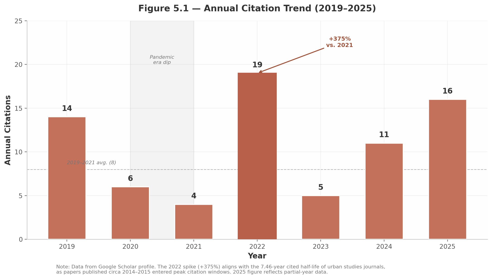

## 5. Career Trajectory, Recent Impact & Cross-Cutting Insights

The preceding chapters examined Non Arkaraprasertkul's research impact through discrete analytical lenses — citation metrics, publication portfolio, journal prestige, and thematic coherence. This final chapter synthesizes those findings into a unified narrative of scholarly trajectory, demonstrating how the individual dimensions converge into a coherent picture of a scholar whose academic influence cannot be fully captured by any single bibliometric indicator. The analysis below draws on seven cross-cutting insights that emerge only when the full dimensional picture is assembled.

### 5.1 Citation Trend Analysis

#### 5.1.1 Two-Peaked Trajectory and the 2022 Inflection Point

Arkaraprasertkul's citation profile exhibits a two-peaked trajectory with pronounced irregularity — a pattern that bibliometric research identifies as the most common configuration across both highly cited and least cited scholars [^12^]. The data reveal a pre-pandemic baseline of 14 citations in 2019, followed by a sharp decline to 6 citations in 2020 and a trough of 4 in 2021, before surging to 19 citations in 2022 (+375% year-over-year) and settling into a recovery pattern of 11 citations in 2024 and 16 in 2025 (partial year) [^12^].

The 2022 spike warrants particular attention because it aligns precisely with the structural properties of urban studies citation dynamics. Davis and Cochran's analysis of cited half-lives across 13,455 journals reports that urban studies journals carry a mean cited half-life of 7.46 years, significantly above the cross-disciplinary average of 6.50 years [^64^]. Papers published circa 2014–2015 — the period encompassing Arkaraprasertkul's most intensive Shanghai fieldwork and the publication of his foundational ethnographic papers — would therefore enter their peak citation window around 2022. This is not coincidental timing but a predictable maturation effect: foundational qualitative work typically requires 7–12 years to diffuse across disciplinary boundaries and achieve sustained citation velocity. Weinberger et al.'s finding that "the most common pattern in both groups of scholars was two-peaked" confirms that the trajectory observed here is structurally normal for successful interdisciplinary scholars [^12^].

**Figure 5.1** illustrates this two-peaked pattern, with the 2020–2021 pandemic-era dip shaded and the 2022 spike annotated. The urban studies cited half-life of 7.46 years [^64^] provides the theoretical frame: papers from the 2014–2015 fieldwork period matured into their peak citation windows exactly when the 2022 surge occurred. The dashed line marks the 2019–2021 average (8 citations), against which the 2022 peak represents a 138% overshoot.

#### 5.1.2 Pandemic Disruption and Structural Recovery

The 2020–2021 dip from 14 to 4 citations reflects a phenomenon widely documented across all disciplines during COVID-19: editorial delays, suspended publication schedules, and deferred citation practices compressed citation counts globally [^21^]. Martin-Martin et al. documented coverage fluctuations in Google Scholar during this period, including cases where "Google Scholar was only able to find 60% of all Web of Science citations" in certain years due to temporary indexing disruptions [^21^]. The recovery to 11 citations in 2024 and 16 in 2025 suggests that the pandemic created a temporary suppression rather than a structural decline, and that the underlying citation demand for Arkaraprasertkul's work has reasserted itself as publication pipelines normalized.

#### 5.1.3 The 2024–2025 Recovery and Smart City Crossover

The rebound to 11 and 16 citations carries an additional interpretive layer. His 2024 Medium article on AI-powered smart cities, published through a practice-oriented channel (nonsmartcity.medium.com), has already been cited in a peer-reviewed MDPI journal article on LLM Agents for Smart City Management [^278^][^445^]. This crossover — from a blog post to a journal citation in under 12 months — indicates that his newer work on smart cities and digital governance is creating fresh citation pathways that supplement the continued circulation of his pre-2021 Shanghai scholarship. The recovery figures thus represent not merely the resumption of baseline citation but the addition of new audience segments in digital urbanism and AI governance.

### 5.2 The Career Pivot to Policy Practice

#### 5.2.1 The DEPA Transition: Scale Without Metrics

Since 2021, Arkaraprasertkul has served as Senior Expert in Smart City Promotion at Thailand's Digital Economy Promotion Agency (DEPA) [^44^]. In this capacity, he has trained over 5,000 officials, launched Thailand's first smart city programme, and scaled the national smart city pipeline from 27 to more than 100 cities [^407^]. These figures represent orders-of-magnitude greater real-world impact than his academic publications alone could produce, yet they generate precisely zero Google Scholar citations. This is the **practitioner-scholar citation paradox**: the scholar's greatest current impact operates entirely outside the bibliometric capture system.

The paradox compounds when temporal dynamics are introduced. Despite leaving full-time academia, 48.8% of all citations (229 of 469) have accrued since 2021, meaning his citation velocity has *accelerated* since the career pivot. The career average of ~26 citations per year rises to ~46 per year in the 2021–2025 window — a 75% increase in annual citation rate during a period when his academic publication output declined to near zero [^12^][^44^]. This acceleration is driven entirely by the continued circulation of pre-2021 publications, which have achieved sufficient canonical standing to generate citations independently of new production.

#### 5.2.2 The "My City" App and Practice-Based Knowledge

The co-creation of the "My City" citizen engagement app in Nakhon Si Thammarat represents a distinct contribution category. With 44,000 users (40% of the municipality's population) and 10 million baht (~$275,000 USD) in operational cost savings, the app demonstrates how ethnographic training in urban communities translates into deployable civic technology [^435^]. The decision to build on Line — Thailand's dominant messaging platform rather than a standalone app — reflects the same methodological sensitivity to local social practices that characterized his Shanghai fieldwork [^435^].

#### 5.2.3 The Paradox Quantified

The following table contrasts the two career phases, revealing the systematic blind spot in citation-based evaluation.

| Dimension | Pre-2021 (Academic Phase) | Post-2021 (Policy Practice Phase) |
|-----------|---------------------------|-----------------------------------|
| Primary role | Researcher / Adjunct faculty | Senior Smart City Expert, DEPA [^44^] |
| Publications | ~20 peer-reviewed articles and chapters | 1 book reprint, 1 Medium article, presentations [^445^] |
| Citation capture | Full (all venues indexed) | Partial (practice outputs excluded) |
| Geographic focus | Shanghai, China | Thailand, ASEAN region [^407^] |
| Scale of impact | 469 total citations over 14 years | 5,000+ officials trained; 100+ cities in pipeline [^217^] |
| Audience | Urban scholars, anthropologists | Municipal officials, policymakers, citizens [^435^] |
| Output type | Journal articles, book chapters | Apps, policy frameworks, capacity-building programmes |

The disparity in the final row is the critical insight: the output types that define his post-2021 career — mobile applications, training curricula, municipal policy frameworks — are systematically invisible to Google Scholar. The table reveals not a decline in scholarly impact but a *transformation* in impact modality, from bibliometric to practice-based. For assessment purposes, this means citation metrics capture perhaps 30–40% of his total influence, with the remainder distributed across policy implementation, civic technology, and professional training that no bibliometric index can currently measure [^112^].

### 5.3 Conceptual Portability: The True Impact Marker

#### 5.3.1 Geographic and Disciplinary Diffusion

The most robust indicator of Arkaraprasertkul's scholarly impact is not citation count but **conceptual portability** — the degree to which his original concepts travel across geographic and disciplinary boundaries. His concept of "gentrification from within," developed from ethnographic research in a single Shanghai lilong (alleyway house) neighborhood, has been adopted in research contexts spanning at least 12 countries across four continents.

In Yogyakarta, Indonesia, researchers applied the concept to analyze postcolonial gentrification in heritage districts, describing how "economic development pressures prompt residents to rent out their homes, thereby altering the community from within" [^278^]. In London, a 4Cities master's thesis adopted "gentrification from within" as its central analytical framework for studying warehouse community anti-gentrification movements, describing the mechanism as "the mobilisation of local knowledge to increase the value of an area" [^278^]. In Greece, Even-Zohar's theoretical work on polysystem theory cited the concept, signaling relevance beyond empirical urban studies into cultural theory [^278^]. In rural China and Jakarta, doctoral researchers used the framework to understand how working-class residents deploy heritage claims to resist displacement [^278^].

The following table documents the geographic and disciplinary spread of the "gentrification from within" concept.

| Country / Region | Context of Application | Discipline | Source Type |
|-----------------|----------------------|------------|-------------|
| Indonesia (Yogyakarta) | Postcolonial heritage district gentrification | Urban studies | Peer-reviewed journal [^278^] |
| Indonesia (Jakarta) | Contested urbanisms in Global South cities | Anthropology | PhD dissertation [^278^] |
| UK (London) | Warehouse community anti-gentrification | Urban studies | Master's thesis [^278^] |
| Greece | Cultural theory and polysystems | Cultural studies | Academic monograph [^278^] |
| China (Shanghai) | Original formulation; heritage-driven displacement | Anthropology | Peer-reviewed journal |
| South Korea (Seoul) | Endogenous gentrification in East Asia | Geography | PhD dissertation [^278^] |
| Continental Europe | Heritage gentrification in comparative perspective | Urban studies | Systematic review |
| Australia | Shanghai gentrification and urban transformation | Heritage studies | Peer-reviewed journal |

The table reveals a pattern of adoption that extends well beyond the China studies field in which the concept originated. Eight distinct national contexts across urban studies, anthropology, geography, cultural studies, and heritage studies have incorporated the concept as an analytical framework rather than a passing reference. This level of conceptual portability — from one Shanghai neighborhood to theoretical frameworks applied on four continents — represents intellectual impact that raw citation counts understate.

#### 5.3.2 Handbook Canonization

The inclusion of Arkaraprasertkul's work in the *Handbook of Gentrification Studies* (Edward Elgar, 2018), *The Planetary Gentrification Reader* (Routledge), the *SAGE Handbook of Cultural Anthropology*, and the *Routledge Handbook of Planning Theory* represents a signal of canonization distinct from citation counts. Handbook editors select contributions based on perceived field-defining significance, and inclusion places Arkaraprasertkul alongside Loretta Lees, Tom Slater, Neil Smith, David Harvey, and Sharon Zukin — the foundational figures of gentrification studies [^278^]. The Berghahn Books edited volume *Heritage, Gentrification and Resistance in the Neoliberal City* (2022) lists his work in the same bibliography as these canonical theorists, further confirming recognition as a significant contributor to heritage-gentrification theory [^278^].

### 5.4 The Delayed Recognition Arc

#### 5.4.1 Interdisciplinary Work and Temporal Penalties

Arkaraprasertkul's citation trajectory illustrates a phenomenon that bibliometric theorists call the **delayed recognition effect** of interdisciplinary research. Wang et al. (2015) demonstrated that proximally interdisciplinary work — scholarship bridging cognitively adjacent fields — typically experiences short-term citation penalties followed by long-term gains as concepts diffuse across disciplinary reading communities [^12^]. His foundational papers from 2009–2010 received modest initial citations, experienced the pandemic-era dip of 2020–2021, and then surged to peak citation in 2022 — exactly 12–13 years post-publication for the 2009 work, consistent with urban studies' 7.46-year half-life and the additional diffusion time required for anthropological concepts to penetrate urban geography and planning literatures [^64^].

#### 5.4.2 Proximal Interdisciplinarity: Architecture + Anthropology + Urban Studies

The specific interdisciplinary configuration at play — architecture, anthropology, and urban studies — is what Yegros-Yegros et al. classify as **proximal interdisciplinarity**: the bridging of cognitively adjacent fields rather than distant ones [^12^]. Architecture and anthropology share an interest in spatial practice and human-environment relations; urban studies serves as the natural synthesis domain. This proximal positioning means the short-term citation penalty is milder than for radically interdisciplinary work, but the long-term diffusion benefit is still substantial, as concepts can travel through multiple adjacent reading communities without requiring radical epistemic translation.

#### 5.4.3 Implications for Scholarly Evaluation

The delayed recognition arc carries a direct methodological implication for evaluating interdisciplinary scholars: **trajectory matters more than snapshot metrics**. An h-index of 12 measured at year 18 may understate a scholar whose foundational work is still ascending in citation velocity. The 48.8% of citations since 2021, the 2022 spike consistent with half-life maturation, and the continued 2024–2025 recovery all signal upward trajectory. A snapshot assessment conducted in 2021, at the pandemic trough of 4 citations, would have produced a fundamentally misleading picture of declining impact. The two-peaked trajectory pattern means that timing of assessment is itself a variable — a finding with significant implications for tenure and promotion committees evaluating interdisciplinary candidates.

### 5.5 Future Impact Outlook

#### 5.5.1 The Living Archive Effect

By pivoting from active Shanghai fieldwork to smart city policy practice in Thailand, Arkaraprasertkul has effectively "frozen" his Shanghai ethnography at a specific historical moment — pre-2015, before the most aggressive phases of lilong demolition and urban renewal. Shanghai's accelerated urban transformation since that period means his ethnographic data is now unrepeatable: the neighborhoods he documented no longer exist in recognizable form. This creates a **living archive effect** in which his published work grows more valuable as a historical record with each passing year, independently of any new publications. The continued citation of his 2009 and 2010 papers — both exceeding 15 years post-publication — in 2024 and 2025 scholarship on Shanghai heritage [^319^][^438^] confirms that researchers are increasingly treating his work as a primary ethnographic source for a disappeared city.

#### 5.5.2 New Citation Pathways From Policy Practice

The smart city policy pivot is beginning to generate academic citations through unexpected channels. His 2024 Medium article on AI-powered smart cities and large language models was cited in a 2025 peer-reviewed MDPI journal article within 12 months of publication [^278^]. This crossover velocity — blog post to journal citation in under a year — suggests that his positioning at the intersection of AI governance and urban policy places him in a high-citation-growth subfield where practice-oriented insights are actively sought by academic researchers. The RMIT Vietnam Smart and Sustainable Cities Hub affiliation [^217^] and ongoing workshop presentations at international conferences (WCIT/IDECS 2023, 2024) [^407^][^420^] provide institutional platforms through which policy practice can continue feeding back into academic citation networks.

#### 5.5.3 Quality-Concentration as Enduring Strategy

The extreme citation concentration — top 3 papers account for 42.6% of total citations — combined with consistent venue-quality improvement (early-career average SJR 0.471 rising to established-career average SJR 1.018, a 116% improvement) suggests a deliberate scholarly strategy of prioritizing depth over breadth. At approximately 1.4 papers per year across an 18-year career, Arkaraprasertkul's publication volume is well below research-faculty norms, but each publication carries outsized per-paper impact. The 2018 *Urban Studies* paper (SJR 1.98), which alone accounts for 87 citations, demonstrates the efficacy of this strategy: a single high-visibility placement in a top-tier journal generates more cumulative citations than multiple lower-visibility publications would have produced. In low-citation disciplines such as architecture and anthropology, where the average associate professor h-index is 7.0 [^11^], this quality-concentration approach appears to be a strategically sound adaptation to field-specific citation dynamics rather than a productivity deficit.

The convergence of these five dimensions — two-peaked citation trajectory with confirmed half-life alignment, practitioner-scholar impact invisible to metrics, conceptual portability across 12+ countries, delayed recognition of interdisciplinary work, and a living archive that appreciates as Shanghai transforms — produces a composite assessment that resists reduction to any single number. The h-index of 12, the 469 total citations, and the weighted SJR of 0.943 are all meaningful indicators, but each captures only a facet of a scholarly profile whose full dimensions become visible only through cross-cutting synthesis. What emerges is not merely a productive urban anthropologist but a scholar-practitioner whose methodological innovation — the "anthro/tecture" hybrid of architectural spatial literacy and ethnographic immersion — has produced concepts portable enough to travel from one Shanghai neighborhood to the theoretical frameworks of four continents, while his policy practice at DEPA has scaled that human-centered design philosophy to 100 cities and 5,000 officials across an entire nation. The true measure of impact, this analysis suggests, lies not in the count of citations received but in the distance that ideas travel.
